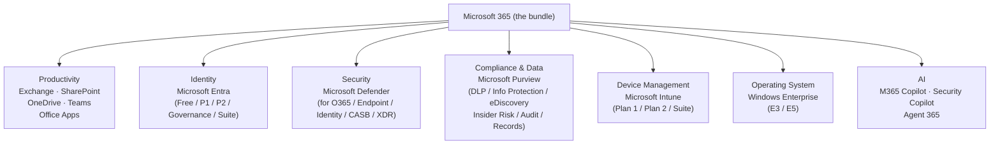
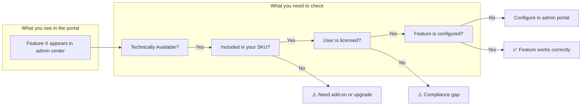

# 01 — Mental Model & Licensing Vocabulary

> Back to [Index](00-index.md)

---

## The Core Mental Model: Microsoft Licensing is a Stack, Not a Ladder

The most common mistake people make is thinking of Microsoft 365 tiers as a single ladder:

```
❌ Wrong mental model:
E3 → E5 → E7     (just "more of the same")
```

The correct mental model is a **layered stack** of independent product families that Microsoft bundles together in various combinations:

```
✅ Correct mental model:

┌─────────────────────────────────────────────────────┐
│                  MICROSOFT 365                      │
│                                                     │
│  ┌──────────────┐  ┌───────────┐  ┌─────────────┐  │
│  │ PRODUCTIVITY │  │ IDENTITY  │  │  SECURITY   │  │
│  │              │  │           │  │             │  │
│  │ Exchange     │  │ Microsoft │  │ Microsoft   │  │
│  │ SharePoint   │  │ Entra     │  │ Defender    │  │
│  │ OneDrive     │  │           │  │             │  │
│  │ Teams        │  │ Free      │  │ Defender    │  │
│  │ Office Apps  │  │ P1        │  │ for O365    │  │
│  │              │  │ P2        │  │ Defender    │  │
│  └──────────────┘  │ Gov'ance  │  │ for Endpt  │  │
│                    │ Suite     │  │ Defender    │  │
│  ┌──────────────┐  └───────────┘  │ for Idntty │  │
│  │ COMPLIANCE / │                 │ Defender   │  │
│  │ DATA SECRITY │  ┌───────────┐  │ for CASB   │  │
│  │              │  │  DEVICE   │  │ XDR        │  │
│  │ Microsoft    │  │  MGMT     │  └─────────────┘  │
│  │ Purview      │  │           │                   │
│  │              │  │ Intune    │  ┌─────────────┐  │
│  │ Info Prot.   │  │ Plan 1    │  │     AI      │  │
│  │ DLP          │  │ Plan 2    │  │             │  │
│  │ eDiscovery   │  │ Suite     │  │ M365 Coplt  │  │
│  │ Audit        │  └───────────┘  │ Security   │  │
│  │ Insider Risk │                 │ Copilot    │  │
│  │ Comm.Comply  │  ┌───────────┐  │ Agent 365  │  │
│  └──────────────┘  │ OPERATING │  └─────────────┘  │
│                    │  SYSTEM   │                   │
│                    │           │                   │
│                    │ Windows   │                   │
│                    │ Enterpise │                   │
│                    │ E3 / E5   │                   │
│                    └───────────┘                   │
└─────────────────────────────────────────────────────┘
```

**E3, E5, and E7 are bundles** that include different tiers from each of these product families. They are NOT simply "more Office features."



---

## What E3 / E5 / E7 Actually Are

| Bundle | Productivity tier | Identity tier | Security tier | Compliance tier | AI tier |
|--------|------------------|--------------|--------------|----------------|---------|
| **M365 E3** | Full (Office apps, Exchange Plan 2, SharePoint, Teams) | Entra P1 | Defender for Endpoint **P1** | Purview baseline | None (Copilot = add-on) |
| **M365 E5** | Full + Power BI Pro, Phone System | Entra **P2** | Defender for Endpoint **P2** + Defender for O365 P2 + Defender for Identity + CASB | Purview **advanced** (Insider Risk, eDiscovery Premium, Audit Premium) | **Security Copilot** included; M365 Copilot = add-on |
| **M365 E7** | Same as E5 | Full **Entra Suite** (P2 + Governance + Private Access + Internet Access + Verified ID) | Same as E5 + Agent security posture | Same as E5 + agentic governance | **M365 Copilot** included + **Agent 365** included |

> **Key insight:** E7 = E5 + Microsoft Copilot + Microsoft Entra Suite + Agent 365, packaged in one SKU. E7 became generally available **May 1, 2026**.

---

## Licensing Vocabulary Reference

Before discussing specific SKUs, you need a shared vocabulary. Every term below has a precise meaning in Microsoft licensing.

---

### SKU
**Definition:** Stock Keeping Unit. A purchasable product identifier.
**Example:** `Microsoft 365 E5` is a SKU. `Microsoft Entra ID P2` is a SKU.
**Why it matters:** Multiple SKUs can deliver the same capability. Knowing the SKU name doesn't tell you what's inside unless you know the contents.

---

### Product
**Definition:** A specific Microsoft service or application (Exchange Online, Intune, Defender for Endpoint).
**Example:** `Microsoft Intune` is a product. It is included in multiple SKUs (M365 E3, EMS E3, standalone).
**Why it matters:** One product may appear across many SKUs. Asking "do I have Intune?" requires knowing which SKU you have.

---

### Suite
**Definition:** A bundle of multiple products sold together under one name.
**Example:** `Microsoft Entra Suite` bundles Private Access + Internet Access + ID Governance + ID Protection + Verified ID premium.
**Why it matters:** A suite is not a single product. "I have Entra Suite" means you have five distinct capabilities.

---

### Bundle
**Definition:** Similar to a suite, but often used to describe larger commercial packages (M365 E3, E5, E7).
**Example:** `Microsoft 365 E3` bundles Office 365 E3 + Windows Enterprise E3 + EMS E3 (approximately).
**Why it matters:** Understanding what's bundled inside a bundle prevents double-purchasing and identifies gaps.

---

### Base License
**Definition:** The foundational license a user must have before add-ons apply.
**Example:** `Microsoft 365 E3` is the required base license for the `Microsoft Purview Suite` add-on.
**Why it matters:** Add-ons without a valid base license cannot be assigned.

---

### Add-on
**Definition:** A license that supplements a base license with additional capabilities. Cannot be purchased or used alone.
**Example:** `Microsoft Purview Suite` is an add-on. It requires Microsoft 365 E3 (or Office 365 E3 + EMS E3) as the base.
**Why it matters:** You cannot substitute an add-on for the base license. You need both.

---

### Standalone License
**Definition:** A license that can be purchased without requiring another Microsoft 365 subscription.
**Example:** `Microsoft Defender for Endpoint Plan 2` is available as a standalone user subscription license.
**Why it matters:** Standalone licenses allow organizations to purchase specific capabilities without upgrading an entire bundle.

---

### Supplemental License
**Definition:** A license that extends an existing license's capabilities without replacing it.
**Example:** `Microsoft Defender Vulnerability Management add-on` extends Defender for Endpoint Plan 2 with premium vulnerability management.
**Why it matters:** Supplemental licenses are distinct from standalone — they add to an existing entitlement rather than replacing it.

---

### Prerequisite License
**Definition:** A license that must already exist before another license can be purchased or used.
**Example:** The `Microsoft Entra Suite` requires a Microsoft Entra ID P1 subscription (or a package that includes P1) as a prerequisite.
**Why it matters:** Purchasing an add-on without its prerequisite creates a licensing violation even if the feature appears functional in the portal.

---

### Qualifying License
**Definition:** Microsoft documentation term for "one of these licenses is required." Commonly used in service descriptions.
**Example:** The Purview service description says: "Users benefiting from Audit (Premium) require one of the following: Microsoft 365 E5/A5/G5, Office 365 E5/A5/G5, Microsoft Purview Suite, or Microsoft 365 E5 eDiscovery & Audit."
**Why it matters:** Multiple different SKUs may qualify — you don't always need the most expensive one.

---

### Step-up License
**Definition:** A license that upgrades an existing subscription to a higher tier.
**Example:** Moving from `Microsoft 365 E3` to `Microsoft 365 E5` via a step-up license — you pay the difference, not the full E5 price.
**Why it matters:** Step-ups allow granular upgrades for specific users rather than moving everyone.

---

### Service Plan
**Definition:** An individual capability or service within a SKU, tracked separately by Microsoft's licensing engine.
**Example:** `Microsoft 365 E5` contains service plans for `Exchange Online Plan 2`, `Defender for Office 365 Plan 2`, `Microsoft Entra ID P2`, and many others.
**Why it matters:** You can assign a full SKU but disable specific service plans for individual users if the business requires it.

---

### Entitlement
**Definition:** The legal right to use a specific capability based on a valid license.
**Example:** A user with `Microsoft 365 E5` has an entitlement to use `Microsoft Defender for Identity`. A user with `Microsoft 365 E3` does not.
**Why it matters:** A feature may appear in the admin portal even without entitlement (see "Technically Available vs Licensed").

---

### Feature Entitlement
**Definition:** The right to use a specific feature within a product, based on license tier.
**Example:** `Sensitivity labels` exist at all tiers, but auto-labeling (automatic application) is a feature entitlement requiring E5 or Purview Suite.
**Why it matters:** Not all features within a product are available at all license levels.

---

### Per-User License
**Definition:** A license assigned to an individual user. That user can access the licensed service.
**Example:** Microsoft Defender for Endpoint Plan 2 is a per-user license. Each user who has endpoints protected by Defender for Endpoint Plan 2 requires this license.
**Why it matters:** Per-user licensing means you pay per head. If 100 users need a feature, you need 100 licenses.

---

### Per-Device License
**Definition:** A license assigned to a specific device, not a user.
**Example:** Windows Enterprise can be licensed per-device rather than per-user in some scenarios.
**Why it matters:** Per-device licensing can be more economical when multiple users share one device (e.g., frontline shift workers).

---

### Tenant-Level License
**Definition:** A capability that is activated for the entire tenant when the minimum licensing threshold is met, regardless of which specific users have the license.
**Example:** `Microsoft Defender for Identity` is described as activated at the tenant level — it protects all identities in the tenant once sufficient licenses are purchased.
**Why it matters:** Even though a feature is tenant-wide, Microsoft's Product Terms still require licenses for all users who benefit from the service. Having 10 Defender for Identity licenses does not legally cover 500 users.

---

### Capacity License
**Definition:** A license based on volume or consumption (storage, compute units, API calls).
**Example:** `Security Compute Units (SCUs)` for Security Copilot are capacity-based. E5 and E7 customers receive 400 SCU/month per 1,000 paid users.
**Why it matters:** Capacity licenses work differently from per-user licenses — you purchase throughput, not seats.

---

### Consumption-Based Licensing
**Definition:** Pay-per-use licensing where costs scale with actual usage.
**Example:** Azure Information Protection features billed through Azure consumption. Some Purview capabilities (like network data protection) require an Azure subscription linked to your tenant.
**Why it matters:** Consumption-based features can generate unexpected costs if usage is not monitored.

---

### License Stacking
**Definition:** Combining multiple licenses to achieve a specific set of capabilities.
**Example:** `Microsoft 365 E3` + `Microsoft Purview Suite` + `Microsoft Entra Suite` = a capability set approaching E5 in some (but not all) areas.
**Why it matters:** Stacking is sometimes more economical than upgrading all users to E5. But the sum of parts is NOT officially equivalent to E5 unless Microsoft says so.

---

### License Assignment
**Definition:** The act of applying a license to a specific user or device.
**Example:** An administrator assigns the `Microsoft 365 E5` SKU to a specific user in the Microsoft 365 Admin Center. That user then has access to E5 capabilities.
**Why it matters:** Purchasing a license does not automatically grant it to users. Assignment is a separate administrative step.

---

### Included Capability
**Definition:** A feature or service that is part of a SKU at no additional cost.
**Example:** `Microsoft Entra ID P1` is included in `Microsoft 365 E3`. You do not pay extra for it.
**Why it matters:** Understanding what's included prevents unnecessary add-on purchases.

---

### Separately Licensed Capability
**Definition:** A feature not included in a base SKU that requires an additional license.
**Example:** `Microsoft 365 Copilot` is a separately licensed capability for E3 and E5 customers (included in E7).
**Why it matters:** Many features visible in the admin portal are only accessible to licensed users.

---

### Technically Available vs. Licensed for Use

> ⚠️ **This is one of the most important distinctions in Microsoft licensing.**

```
Technically Available  ≠  Included in SKU  ≠  Licensed for Use  ≠  Configured/Enabled
```

**Technically Available:** The feature exists in Microsoft's infrastructure and may appear in your admin portal.
**Included in SKU:** The feature is part of what you purchased.
**Licensed for Use:** You have a valid license that legally entitles your users to use the feature.
**Configured/Enabled:** An administrator has turned on the feature.

**Example:** Microsoft Defender for Identity is a tenant-level service. If you have 5 Defender for Identity licenses in a 500-user tenant, the feature may appear functional in the portal. But only 5 users are legally licensed. Using it for all 500 without purchasing 500 licenses is a compliance violation.

**Why it matters:** Microsoft compliance reviews and audits check for this. The presence of a feature in your admin portal does NOT mean you are licensed to use it for all users.

---

### Current SKU
**Definition:** A SKU that Microsoft currently sells and supports.
**Example:** `Microsoft Purview Suite` is a current SKU (as of September 2026).

### Legacy SKU
**Definition:** A SKU that Microsoft no longer actively sells but may still be in use by existing customers.
**Example:** `Microsoft 365 E5 Compliance` (the old add-on name) is a legacy SKU.

### Retired SKU
**Definition:** A SKU that no longer exists and cannot be purchased.
**Example:** `Office 365 Advanced Compliance` is retired.

### Renamed SKU
**Definition:** A SKU that still exists but under a different name.
**Example:** `Microsoft Information Protection` was renamed to `Microsoft Purview Information Protection`.

### Replacement SKU
**Definition:** The current SKU that replaced a retired or renamed SKU.
**Example:** `Microsoft Purview Suite` replaces/supersedes `Microsoft 365 E5 Compliance` (the add-on SKU).

---

## The Licensing Stack Visualized



---

## Sources

- [Microsoft Learn — M365 plan options](https://learn.microsoft.com/en-us/office365/servicedescriptions/office-365-platform-service-description/office-365-plan-options)
- [Microsoft Learn — E3/E5/E7 feature comparison (Copilot)](https://learn.microsoft.com/en-us/microsoft-365/copilot/microsoft-365-copilot-license-feature-overview)
- [Microsoft Learn — Purview service description (licensing terms)](https://learn.microsoft.com/en-us/office365/servicedescriptions/microsoft-365-service-descriptions/microsoft-365-tenantlevel-services-licensing-guidance/microsoft-purview-service-description)
- [Microsoft Product Terms](https://www.microsoft.com/licensing/terms/en-US/product/changes/)
