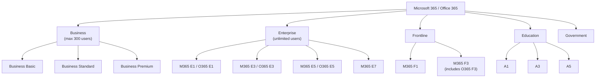
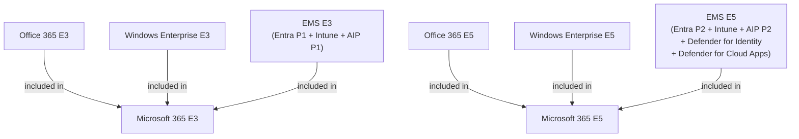
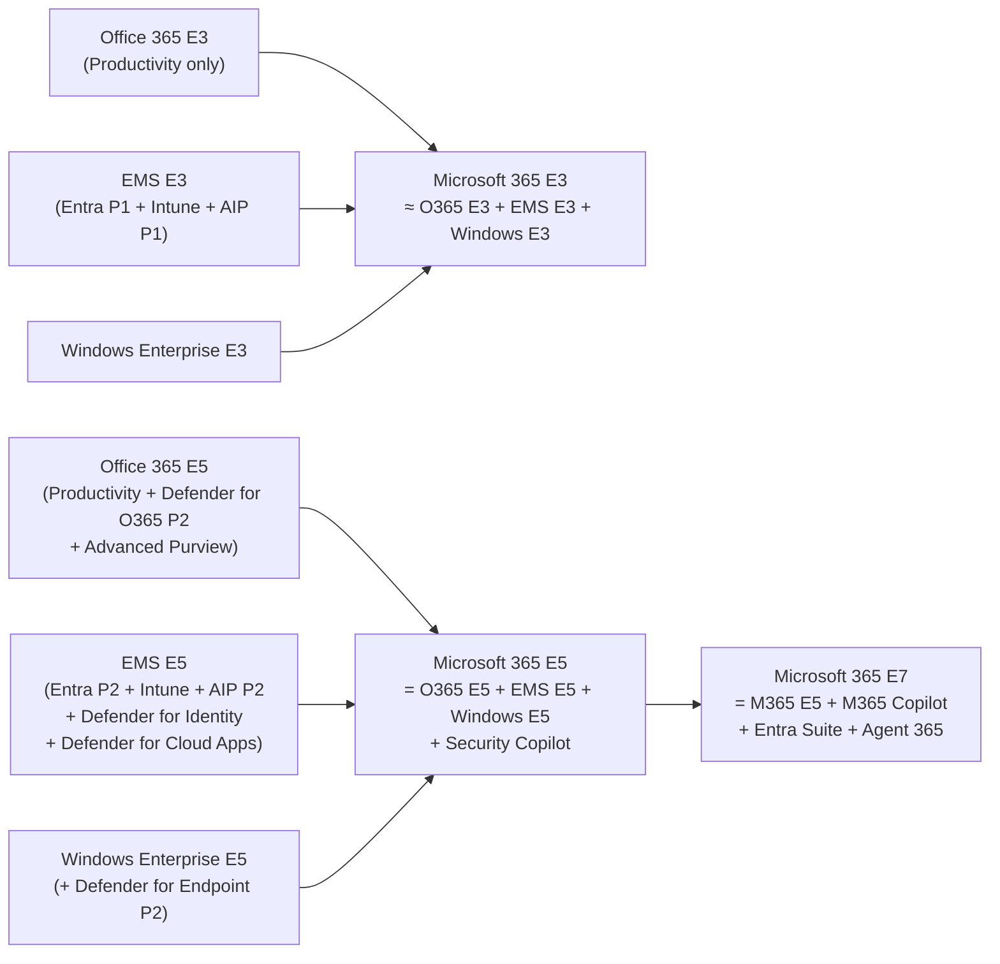

# 02 — Licensing Families & Office 365 vs Microsoft 365

> Back to [Index](00-index.md)

---

## The Major Microsoft 365 Licensing Families

---

## Target Audience for Each Family

| Family | User count | Who it's for | Key characteristic |
|--------|-----------|-------------|-------------------|
| **Business** | ≤ 300 users | SMBs | Simpler feature set; 300-seat hard cap across entire tenant |
| **Enterprise** | Unlimited | Large organizations | Full feature depth; no seat cap |
| **Frontline** | Unlimited | Deskless/shift workers | Restricted device/app usage; mobile-first; cheaper |
| **Education** | Unlimited | Schools/universities | A1 is free (web apps); A3/A5 parallel E3/E5 |
| **Government** | Unlimited | US Gov agencies | GCC, GCC High, DoD variants of E3/E5 |

> **The 300-seat limit** applies to the entire *Business* family within a single tenant. If you have 250 Business Premium seats, you can only add 50 more Business-family licenses total. Organizations exceeding 300 users must move to Enterprise plans.

---

## The Related Product Families

Beyond the "Microsoft 365" brand, these product families are distinct but related:

| Family | What it is | Where it appears |
|--------|-----------|-----------------|
| **Office 365** | The *productivity-only* predecessor/subset of Microsoft 365 | E1/E3/E5, F3 still available |
| **Microsoft 365** | Office 365 + Windows Enterprise + EMS (identity/device/security) bundled | E3/E5/E7/F1/F3/Business |
| **Enterprise Mobility + Security (EMS)** | Entra + Intune + Information Protection, separately purchasable | EMS E3 / EMS E5 |
| **Microsoft Entra** | Identity and network access product family | Included in M365; sold standalone |
| **Microsoft Defender** | Security product family | Included in M365 E5; Defender Suite sold separately |
| **Microsoft Purview** | Compliance and data security product family | Included partially in E3; advanced in E5; Purview Suite add-on |
| **Microsoft Intune** | Device management product | Included in M365 E3/E5; Intune Suite add-on |
| **Windows Enterprise** | Enterprise Windows features | Included in M365 E3/E5; sold standalone |

---

## Office 365 vs. Microsoft 365 — The Real Difference

This is one of the most common areas of confusion. They are *not* the same product.

### Office 365 Plans — Productivity Only

| SKU | What it provides |
|-----|-----------------|
| **Office 365 E1** | Exchange Online Plan 1, SharePoint, OneDrive, Teams, Office web apps (no desktop Office, no voicemail) |
| **Office 365 E3** | Office 365 E1 + desktop Office apps + Exchange Plan 2 + eDiscovery Standard + Audit Standard + basic Purview |
| **Office 365 E5** | Office 365 E3 + Phone System + Audio Conferencing + Power BI Pro + **Defender for Office 365 Plan 2** + advanced Purview (eDiscovery Premium, Audit Premium, Insider Risk, Communication Compliance, Customer Lockbox) |

> **Common mistake:** People assume Office 365 E5 = Microsoft 365 E5. They are very different. O365 E5 focuses on productivity + some advanced compliance and email security. It does NOT include Windows Enterprise, Intune, Defender for Endpoint, Defender for Identity, or Entra ID P2.

### Microsoft 365 Plans — Productivity + Identity + Security + Windows

| SKU | What it adds over the O365 equivalent |
|-----|--------------------------------------|
| **Microsoft 365 E3** | Over O365 E3: Windows Enterprise E3, Intune Plan 1, Entra ID P1, Defender for Endpoint P1 |
| **Microsoft 365 E5** | Over O365 E5: Windows Enterprise E5, Entra ID P2, Defender for Endpoint P2, Defender for Identity, Defender for Cloud Apps, full advanced Purview, Security Copilot |
| **Microsoft 365 E7** | Over M365 E5: Microsoft 365 Copilot (included, not add-on), full Entra Suite (vs just P2), Agent 365 |

### Comparison: O365 E3 vs M365 E3

| Capability | Office 365 E3 | Microsoft 365 E3 |
|------------|--------------|-----------------|
| Exchange Online Plan 2 | ✅ | ✅ |
| SharePoint / OneDrive | ✅ | ✅ |
| Teams | ✅ | ✅ |
| Desktop Office apps | ✅ | ✅ |
| Windows Enterprise E3 | ❌ | ✅ |
| Microsoft Intune Plan 1 | ❌ | ✅ |
| Microsoft Entra ID P1 | ❌ | ✅ |
| Defender for Endpoint P1 | ❌ | ✅ |
| Conditional Access | ❌ | ✅ (requires Entra P1) |
| Basic Purview (Audit Standard, eDiscovery Standard) | ✅ | ✅ |

> **Practical implication:** An organization on Office 365 E3 that wants Conditional Access, device management, and endpoint protection must either upgrade to Microsoft 365 E3 or purchase EMS E3 separately. The licensing architecture of Microsoft 365 E3 bundles all of this together.

### Comparison: O365 E5 vs M365 E5

| Capability | Office 365 E5 | Microsoft 365 E5 |
|------------|--------------|-----------------|
| Phone System + Audio Conferencing | ✅ | ✅ |
| Power BI Pro | ✅ | ✅ |
| Defender for Office 365 P2 | ✅ | ✅ |
| Advanced Purview (eDiscovery Premium, Insider Risk, etc.) | ✅ | ✅ |
| Windows Enterprise E5 | ❌ | ✅ |
| Entra ID P2 (vs P1 in O365 E5) | ❌ | ✅ |
| Defender for Endpoint P2 | ❌ | ✅ |
| Defender for Identity | ❌ | ✅ |
| Defender for Cloud Apps | ❌ | ✅ |
| Security Copilot | ❌ | ✅ |

---

## How These Families Relate to Each Other

> **Note:** The "≈" and "=" in the diagram above represent conceptual bundling, not a perfect mathematical equivalence. Microsoft's exact service plan composition of E3/E5 may include minor variations from what you'd get by purchasing the components separately. Always verify specific entitlements in the Microsoft Product Terms.

---

## Sources

- [Microsoft Learn — M365 plan options](https://learn.microsoft.com/en-us/office365/servicedescriptions/office-365-platform-service-description/office-365-plan-options)
- [Microsoft — Compare M365 Enterprise plans](https://www.microsoft.com/en-us/microsoft-365/enterprise/microsoft-365-plans-and-pricing)
- [Microsoft — Compare M365 vs Office 365](https://www.microsoft.com/en-us/microsoft-365/enterprise/compare-microsoft-365-and-office-365)
- [Microsoft Learn — E3/E5/E7 feature comparison](https://learn.microsoft.com/en-us/microsoft-365/copilot/microsoft-365-copilot-license-feature-overview)
