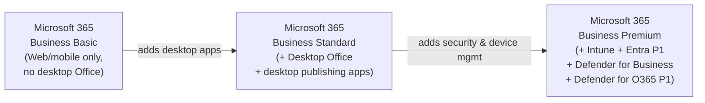

# 03 — Business Licensing (Basic / Standard / Premium)

> Back to [Index](00-index.md)

---

## Overview

The Business family is designed for organizations with **up to 300 users**. Beyond 300 seats, you must use Enterprise plans. The 300-seat cap is enforced at the tenant level — it applies across *all* Business-family plans combined.

> **Important:** The arrows show conceptual progression. Business Premium is NOT simply Business Standard + Defender. The security additions are substantial and include endpoint detection, identity protection, and device management capabilities that do not exist in Standard.

---

## Microsoft 365 Business Basic

**Target audience:** Small businesses that need cloud productivity with minimal cost. Users work primarily in browsers or on mobile.

### What's included

| Capability | Included | Notes |
|-----------|---------|-------|
| Exchange Online | ✅ Plan 1 | 50 GB mailbox |
| SharePoint Online | ✅ | |
| OneDrive | ✅ | 1 TB per user |
| Microsoft Teams | ✅ | Full Teams capabilities |
| Office web apps | ✅ | Word, Excel, PowerPoint, OneNote in browser |
| Office desktop apps | ❌ | Not included |
| Microsoft Entra ID | ✅ | Free tier (security defaults, basic MFA) |
| Conditional Access | ❌ | Requires Entra P1 |
| Microsoft Intune | ❌ | Basic Mobility & Security only (limited MDM) |
| Defender for Endpoint | ❌ | |
| Defender for Office 365 | ❌ | Exchange Online Protection (EOP) only |
| Purview (Compliance) | ✅ | Audit Standard, basic retention, Compliance Manager |
| Windows Enterprise | ❌ | |
| Power BI | ❌ | |

### Key limitations
- No desktop Office apps — users must use browser/mobile versions
- No full MDM — Basic Mobility & Security is not Intune
- No advanced identity — no Conditional Access, no PIM, no risk-based policies
- No endpoint security — no EDR, no attack surface reduction rules
- EOP provides baseline email protection but not Safe Links/Safe Attachments

---

## Microsoft 365 Business Standard

**Target audience:** Businesses that need desktop Office apps in addition to cloud productivity.

### What Standard adds over Basic

| Capability | Change |
|-----------|--------|
| Office desktop apps | ✅ Added (Word, Excel, PowerPoint, Outlook, Publisher, Access on PC) |
| Desktop publishing | ✅ Publisher, Access (PC only) |

> Everything else (identity, security, device management, compliance) remains the same as Business Basic. Standard is a productivity upgrade, not a security upgrade.

---

## Microsoft 365 Business Premium

**Target audience:** SMBs that need enterprise-grade security, device management, and identity in addition to full productivity. This is the most security-capable Business plan.

### What Premium adds over Standard

| Capability | Change | Notes |
|-----------|--------|-------|
| Microsoft Entra ID P1 | ✅ Added | Conditional Access, SSPR with writeback, dynamic groups, hybrid join |
| Microsoft Intune Plan 1 | ✅ Added | Full MDM and MAM; replaces Basic Mobility & Security |
| Defender for Business | ✅ Added | Enterprise-grade endpoint security for up to 300 employees |
| Defender for Office 365 Plan 1 | ✅ Added | Safe Links, Safe Attachments, anti-phishing |
| Azure Information Protection Plan 1 | ✅ Added | Manual sensitivity labels, basic classification |
| Windows Autopilot | ✅ Added | Zero-touch device provisioning |

> **Defender for Business** is NOT the same as Defender for Endpoint Plan 1 or Plan 2. It is a simplified endpoint security solution designed specifically for SMBs (≤300 users). It provides EDR, automated investigation and remediation, and cross-platform protection in a simplified management experience. It does not include all capabilities of Defender for Endpoint Plan 2.

### What Business Premium does NOT include (even vs E3)

| Capability | Business Premium | M365 E3 |
|-----------|----------------|---------|
| Seat limit | 300 max | Unlimited |
| Entra ID tier | P1 | P1 |
| Intune | Plan 1 | Plan 1 |
| Defender for Endpoint | Defender for Business (simplified) | Defender for Endpoint P1 (full) |
| Defender for Office 365 | P1 | P1 included; P2 = E5 |
| Windows Enterprise | ❌ | ✅ E3 |
| Entra ID P2 features | ❌ | ❌ (requires E5) |
| Purview advanced (Insider Risk, eDiscovery Premium) | ❌ | ❌ (requires E5 or Purview Suite) |

---

## Business Premium Security Add-ons (2025–2026)

Microsoft introduced new add-ons for Business Premium to allow SMBs to extend their security capabilities without migrating to Enterprise:

| Add-on | What it adds | Prerequisite |
|--------|-------------|-------------|
| **Microsoft Defender Suite for Business Premium** | Upgrades Defender for Business to Defender for Endpoint P2-level capabilities; adds Entra ID P2, Defender for Identity, Defender for Cloud Apps | Business Premium |
| **Microsoft Purview Suite for Business Premium** | Adds advanced Purview: Audit Premium, eDiscovery Premium, Insider Risk Management, Communication Compliance, Records Management | Business Premium |
| **Microsoft Defender + Purview Suite for Business Premium** | Both of the above combined | Business Premium |

> These add-ons were introduced to bridge the gap between Business Premium and E5-level security/compliance for SMBs who cannot use Enterprise plans.

---

## Comparison Table

| Feature | Business Basic | Business Standard | Business Premium |
|---------|--------------|------------------|-----------------|
| Desktop Office apps | ❌ | ✅ | ✅ |
| Exchange Online | Plan 1 | Plan 1 | Plan 1 |
| SharePoint / OneDrive | ✅ | ✅ | ✅ |
| Teams | ✅ | ✅ | ✅ |
| Entra ID tier | Free | Free | **P1** |
| Conditional Access | ❌ | ❌ | ✅ |
| Intune | Basic Mobility only | Basic Mobility only | **Plan 1 (full)** |
| Endpoint security | ❌ | ❌ | **Defender for Business** |
| Email security | EOP only | EOP only | **Defender for O365 P1** |
| Sensitivity labels (manual) | ❌ | ❌ | ✅ (AIP P1) |
| DLP | ❌ | ❌ | Basic (Exchange/SharePoint) |
| eDiscovery | Standard | Standard | Standard |
| Audit | Standard | Standard | Standard |
| Windows Enterprise | ❌ | ❌ | ❌ |
| Seat limit | 300 | 300 | 300 |

---

## When to Use Business Premium vs E3

| Consideration | Business Premium | Microsoft 365 E3 |
|--------------|-----------------|-----------------|
| Org size | ≤300 users | Unlimited |
| Security needs | Good endpoint + identity | Good endpoint + identity |
| Endpoint detection | Defender for Business (simplified) | Defender for Endpoint P1 (full) |
| Advanced compliance | Add Purview Suite (add-on) | Add Purview Suite (add-on) |
| Windows management | No Windows Enterprise | Windows Enterprise E3 |
| Cost | Lower per-seat | Higher per-seat |
| **Recommendation** | SMB with security awareness | Enterprise or growing orgs needing Windows rights |

---

## Sources

- [Microsoft — Business Premium overview](https://www.microsoft.com/en-us/microsoft-365/business/microsoft-365-business-premium)
- [Microsoft Learn — Business for Business security overview](https://learn.microsoft.com/en-us/microsoft-365/admin/security-and-compliance/m365b-security-overview)
- [Microsoft — Business security add-ons announcement](https://techcommunity.microsoft.com/blog/microsoft-security-blog/introducing-new-security-and-compliance-add-ons-for-microsoft-365-business-premi/4449297)
- [Microsoft — Defender for Business requirements](https://learn.microsoft.com/en-us/defender-business/mdb-requirements)
- [Microsoft Learn — Purview Suite for Business Premium](https://www.microsoft.com/en-us/security/small-medium-business/microsoft-purview-suite-business-premium)
