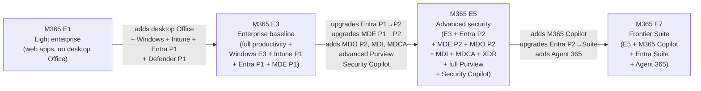
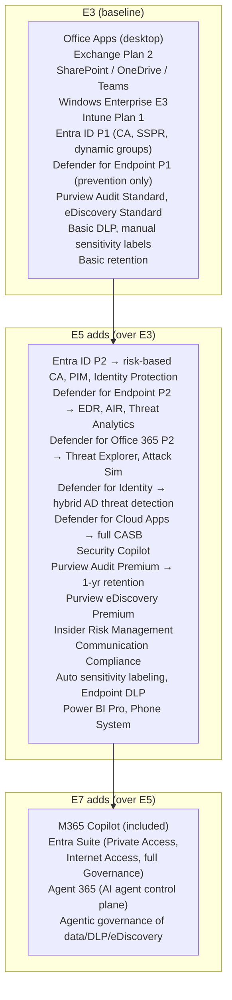

# 04 — Enterprise E-Series (E1 / E3 / E5 / E7)

> Back to [Index](00-index.md)

---

## Overview

Enterprise plans have no seat limit. They are the core of Microsoft's commercial licensing for organizations of all sizes that outgrow Business plans or need more capability.



---

## Microsoft 365 E1

**Target audience:** Enterprise users who primarily need cloud collaboration and communication without desktop Office apps. Often used for Kiosk or light-use workers at enterprise scale.

| Capability | E1 |
|-----------|----|
| Exchange Online | Plan 1 (50 GB mailbox) |
| SharePoint Online | ✅ |
| OneDrive | ✅ (1 TB) |
| Teams | ✅ |
| Desktop Office apps | ❌ |
| Office web apps | ✅ |
| Windows Enterprise | ❌ |
| Entra ID | Free / basic |
| Conditional Access | ❌ |
| Intune | ❌ |
| Defender for Endpoint | ❌ |
| Defender for Office 365 | EOP only |
| Purview | Audit Standard, basic |
| Power BI | ❌ |

> **E1 vs Office 365 E1:** They are effectively the same from a productivity standpoint. Microsoft 365 E1 does not add Windows or EMS. Microsoft 365 Enterprise E1 is rarely the best choice — E3 typically makes more economic and capability sense for organizations needing device management.

---

## Microsoft 365 E3 — The Enterprise Baseline

**Target audience:** Enterprise knowledge workers who need full productivity, managed devices, enterprise identity, and baseline endpoint security.

### E3 — Full Capability Breakdown

#### Productivity
| Service | Entitlement |
|---------|------------|
| Exchange Online | Plan 2 (100 GB mailbox, in-place archiving, litigation hold) |
| SharePoint Online | Full |
| OneDrive | 1 TB per user (expandable) |
| Microsoft Teams | Full |
| Microsoft 365 Apps for enterprise | ✅ Desktop Word, Excel, PowerPoint, Outlook, Access, Publisher (PC) |
| Microsoft 365 Apps for mobile | ✅ iOS, Android |
| Viva Engage (core) | ✅ |
| Sway, Forms, Power Apps (basic) | ✅ |

#### Identity — Microsoft Entra ID P1
| Feature | E3 includes |
|---------|------------|
| SSO | ✅ |
| MFA (all methods) | ✅ |
| Conditional Access (policy-based) | ✅ |
| Self-Service Password Reset with writeback | ✅ |
| Dynamic groups | ✅ |
| Hybrid identity (Entra Connect) | ✅ |
| Application proxy | ✅ |
| Identity governance | ❌ (requires P2 or Governance) |
| Risk-based Conditional Access | ❌ (requires P2) |
| Privileged Identity Management (PIM) | ❌ (requires P2) |
| Identity Protection | ❌ (requires P2) |

#### Device Management — Microsoft Intune Plan 1
| Feature | E3 includes |
|---------|------------|
| MDM (Mobile Device Management) | ✅ iOS, Android, Windows, macOS |
| MAM (Mobile App Management) | ✅ |
| Device compliance policies | ✅ |
| Endpoint security policies | ✅ |
| Conditional Access enforcement | ✅ (with Entra P1) |
| Windows Autopilot | ✅ |
| Endpoint analytics | ✅ |
| Remote Help | ❌ (Intune Plan 2 or Suite) |
| Endpoint Privilege Management | ❌ (Intune Suite) |
| Enterprise App Management | ❌ (Intune Suite) |
| Advanced Analytics | ✅ (as of July 2026, included in E3) |

> **July 2026 change:** Starting July 2026, Microsoft rolled select advanced endpoint management capabilities into M365 E3. E3 customers now receive Remote Help and Advanced Analytics (Intune Plan 2 capabilities) at no additional cost. E5 customers additionally get Endpoint Privilege Management (EPM), Cloud PKI, and Enterprise App Management.

#### Security — Microsoft Defender for Endpoint P1
| Feature | E3 includes |
|---------|------------|
| Next-generation antimalware | ✅ |
| Attack surface reduction rules | ✅ |
| Device control | ✅ |
| Network protection | ✅ |
| Application control | ✅ |
| Endpoint detection & response (EDR) | ❌ (requires MDE P2) |
| Automated investigation & remediation | ❌ (requires MDE P2) |
| Threat & vulnerability management | ❌ (requires MDE P2) |
| Defender for Office 365 P1 | ❌ |
| Defender for Office 365 P2 | ❌ |
| Defender for Identity | ❌ |
| Defender for Cloud Apps | ❌ (only basic Cloud Discovery) |
| Microsoft Defender XDR (full) | ❌ |

#### Compliance — Microsoft Purview (Baseline)
| Feature | E3 includes |
|---------|------------|
| Audit (Standard) | ✅ (90-day log retention) |
| eDiscovery (Standard) — search & export | ✅ |
| Retention policies (basic) | ✅ |
| Retention labels (manual application) | ✅ |
| Sensitivity labels (manual application) | ✅ |
| Sensitivity labels (auto-apply) | ❌ (requires E5 or Purview Suite) |
| DLP — Exchange, SharePoint, OneDrive | ✅ |
| DLP — Teams, Endpoints | ❌ (requires E5 or Purview Suite) |
| Records management (basic) | ✅ |
| Information barriers | ❌ |
| Communication compliance | ❌ |
| Insider Risk Management | ❌ |
| Audit (Premium) — 1-year retention, crucial events | ❌ |
| eDiscovery (Premium) — review sets, export | ❌ |
| Customer Key | ❌ |
| Customer Lockbox | ❌ |
| Compliance Manager | ✅ (basic) |

#### Windows
| Feature | E3 includes |
|---------|------------|
| Windows 11 Enterprise E3 | ✅ |
| Windows Autopilot | ✅ |
| BitLocker | ✅ |
| AppLocker | ✅ |
| DirectAccess | ✅ |
| Windows Defender Application Guard | ✅ |
| Credential Guard | ✅ |
| Windows Sandbox | ✅ |
| Windows Update for Business | ✅ |
| Windows Virtual Desktop rights | ✅ |
| Windows Defender Credential Guard | ✅ |

#### What E3 does NOT include
- Microsoft 365 Copilot (add-on, ~$30/user/month)
- Security Copilot
- Entra ID P2 (risk-based CA, PIM, Identity Protection)
- Defender for Endpoint P2 (EDR, automated investigation)
- Defender for Office 365 (any tier — EOP only)
- Defender for Identity
- Defender for Cloud Apps (full)
- Defender XDR (full)
- Advanced Purview capabilities (Insider Risk, eDiscovery Premium, Audit Premium)
- Automatic sensitivity labels
- Endpoint DLP
- Agent 365
- Entra Suite (Private Access, Internet Access)

---

## Microsoft 365 E5 — Advanced Security and Compliance

**Target audience:** Organizations with serious security, identity, and compliance requirements. Security and compliance teams, regulated industries, organizations needing full XDR coverage.

### What E5 adds over E3

> **Do not read this as "E5 is just E3 with more."** E5 represents a fundamentally different security posture. The identity model changes from "known user gets in" (P1 CA) to "risk-adaptive access" (P2 risk-based CA). The endpoint security model changes from "prevention only" (P1) to "full detection, investigation, and response" (P2 EDR). The compliance model changes from "baseline audit and search" to "investigation-grade audit, insider risk detection, and advanced eDiscovery."

#### Identity — Entra ID P2 (over E3's P1)
| Feature | E3 (P1) | E5 (P2) |
|---------|---------|---------|
| Conditional Access (policy-based) | ✅ | ✅ |
| Risk-based Conditional Access | ❌ | ✅ |
| Identity Protection (risky user/sign-in detection) | ❌ | ✅ |
| Privileged Identity Management (PIM) | ❌ | ✅ |
| Access Reviews | ❌ | ✅ (some features) |
| Entitlement Management | ❌ | ✅ (some features) |
| Entra Private Access | ❌ | ❌ (Entra Suite only) |
| Entra Internet Access | ❌ | ❌ (Entra Suite only) |
| ID Governance (full lifecycle workflows) | ❌ | ❌ (Entra Suite only) |
| Verified ID premium | ❌ | ❌ (Entra Suite only) |

> **E5 gives you Entra ID P2, NOT the full Entra Suite.** The Entra Suite includes Private Access, Internet Access, ID Governance, ID Protection, and Verified ID premium — all of which require Entra Suite or are available as add-ons. E7 includes the full Entra Suite.

#### Security — Defender Ecosystem (over E3)
| Product | E3 | E5 |
|---------|----|----|
| Defender for Endpoint | **P1** (prevention) | **P2** (full EDR + investigation + automated response + threat analytics) |
| Defender for Office 365 | EOP only | **P2** (Safe Links + Safe Attachments + AIR + Attack Simulation + Threat Explorer) |
| Defender for Identity | ❌ | ✅ (hybrid AD threat detection) |
| Defender for Cloud Apps | Basic discovery | ✅ (full CASB: discovery + control + app governance + threat protection) |
| Microsoft Defender XDR | Limited | ✅ (full unified XDR portal) |
| Security Copilot | ❌ | ✅ (400 SCU/month per 1,000 users) |

> **Defender for Office 365 in E5:** E5 includes Plan 2. Plan 2 adds: Threat Trackers, Campaign views, Threat Explorer (historical hunting), Attack Simulation Training, and full Defender XDR integration. Plan 1 (in Business Premium) provides real-time protections (Safe Links, Safe Attachments, anti-phishing) but not the investigation and automation capabilities.

#### Compliance — Advanced Purview (over E3)
| Feature | E3 | E5 |
|---------|----|----|
| Audit (Standard) | ✅ 90 days | ✅ |
| Audit (Premium) | ❌ | ✅ 1-year retention, crucial events |
| eDiscovery (Standard) | ✅ search | ✅ search |
| eDiscovery (Premium) | ❌ | ✅ review sets, custodian holds, AI analysis |
| Insider Risk Management | ❌ | ✅ |
| Communication Compliance | ❌ | ✅ |
| Auto sensitivity labeling | ❌ | ✅ |
| Endpoint DLP | ❌ | ✅ |
| Teams DLP | ❌ | ✅ |
| Adaptive Protection | ❌ | ✅ |
| Customer Key | ❌ | ✅ |
| Customer Lockbox | ❌ | ✅ |
| Information barriers | ❌ | ✅ |
| Records Management (advanced) | Basic | ✅ |
| Compliance Manager | Basic | Advanced |

#### Productivity additions in E5 (over E3)
| Feature | E3 | E5 |
|---------|----|----|
| Power BI Pro | ❌ | ✅ |
| Phone System | ❌ | ✅ (Calling Plan = add-on) |
| Audio Conferencing | ❌ | ✅ |

#### What E5 does NOT include (common misconceptions)
- Microsoft 365 Copilot — still an add-on (~$30/user/month)
- Agent 365 — E7 only (or add-on to E5)
- Full Entra Suite (Private Access, Internet Access, full ID Governance) — E7 or add-on
- Intune Suite capabilities (EPM, Enterprise App Management, Cloud PKI) — add-on (some now in E5 as of July 2026)
- Every Purview feature — see specific capability table above
- Defender Vulnerability Management Premium — add-on to MDE P2
- 10-year Audit log retention — separate add-on

---

## Microsoft 365 E7 — The Frontier Suite

**Generally Available: May 1, 2026**
**Definition:** E7 = E5 + Microsoft 365 Copilot + Microsoft Entra Suite + Agent 365

> **E7 is a strict superset of E5.** It adds capabilities; it never removes them.

### What E7 adds over E5

| Component | E5 | E7 |
|----------|----|----|
| Microsoft 365 Copilot | Add-on required | ✅ Included |
| Security Copilot | ✅ (400 SCU/1K users) | ✅ (400 SCU/1K users) |
| Entra ID P2 | ✅ | ✅ |
| **Entra Private Access** | ❌ | ✅ (via Entra Suite) |
| **Entra Internet Access** (Secure Web Gateway + AI Gateway) | ❌ | ✅ (via Entra Suite) |
| **Entra ID Governance** (full lifecycle workflows) | Partial (P2 features only) | ✅ Full (via Entra Suite) |
| **Entra Verified ID** premium (Face Check) | ❌ | ✅ (via Entra Suite) |
| **Microsoft Agent 365** | ❌ | ✅ |
| Agent Conditional Access | ❌ | ✅ (via Agent 365 + Entra Suite) |
| Agent Security Posture Management | ❌ | ✅ |
| Agent lifecycle management | ❌ | ✅ |
| Agentic DLP (DLP policies extend to agent interactions) | ❌ | ✅ |
| Agentic eDiscovery (discover/manage agent interaction data) | ❌ | ✅ |
| Communication Compliance for agents | ❌ | ✅ |
| Label-aware agent interactions | ❌ | ✅ |

### Entra Suite components in E7
The full Microsoft Entra Suite includes five products (all included in E7):
1. **Microsoft Entra Private Access** — Zero Trust Network Access (ZTNA); replaces legacy VPN for private app access
2. **Microsoft Entra Internet Access** — Secure Web Gateway + AI traffic inspection; Microsoft's SSE solution
3. **Microsoft Entra ID Governance** — Full lifecycle workflows, advanced access reviews, advanced entitlement management (features beyond P2)
4. **Microsoft Entra ID Protection** — The P2 risk detection and Identity Protection capabilities (also in E5 via P2)
5. **Microsoft Entra Verified ID** premium — Face Check and premium credential capabilities

### Agent 365 in E7
Agent 365 is the *control plane for AI agents*. It enables organizations to:
- Centrally discover, manage, and govern AI agents across Microsoft 365
- Apply Conditional Access policies to agents (not just users)
- Enforce DLP on agent interactions
- Manage agent identity lifecycle (provisioning → expiration)
- Detect suspicious agent activity and receive security alerts
- Hunt for threats in agent activity via unified observability logs
- Manage agent access packages (what resources agents can access)

> **Agent 365 is available as an add-on** to Microsoft 365 E5/A5/Business Premium (or Microsoft Defender Suite + Microsoft Purview Suite). It is included in E7 at no additional cost.

---

## E3 vs E5 vs E7 — The Real Difference {#e3-vs-e5-vs-e7}

### Capability stack



### Detailed comparison table

| Capability | E3 | E5 | E7 |
|-----------|----|----|-----|
| **Productivity** |
| Desktop Office apps | ✅ | ✅ | ✅ |
| Exchange Online | Plan 2 | Plan 2 | Plan 2 |
| SharePoint / OneDrive / Teams | ✅ | ✅ | ✅ |
| Power BI Pro | ❌ | ✅ | ✅ |
| Phone System / Audio Conferencing | ❌ | ✅ | ✅ |
| Microsoft 365 Copilot | Add-on | Add-on | ✅ included |
| **Identity (Entra)** |
| Entra ID tier | P1 | P2 | P2 + full Suite |
| Conditional Access (policy-based) | ✅ | ✅ | ✅ |
| Risk-based Conditional Access | ❌ | ✅ | ✅ |
| Identity Protection | ❌ | ✅ | ✅ |
| PIM | ❌ | ✅ | ✅ |
| Access Reviews | ❌ | Partial (P2) | Full (Suite) |
| Entitlement Management | ❌ | Partial (P2) | Full (Suite) |
| Lifecycle Workflows | ❌ | ❌ | ✅ (Governance) |
| Entra Private Access | ❌ | ❌ | ✅ |
| Entra Internet Access | ❌ | ❌ | ✅ |
| Agent identity / Agent CA | ❌ | ❌ | ✅ |
| **Security (Defender)** |
| Defender for Endpoint | P1 | P2 | P2 |
| Defender for Office 365 | EOP only | P2 | P2 |
| Defender for Identity | ❌ | ✅ | ✅ |
| Defender for Cloud Apps | Basic | Full | Full |
| Defender XDR | Limited | ✅ | ✅ |
| Security Copilot | ❌ | ✅ | ✅ |
| Agent Security Posture Mgmt | ❌ | ❌ | ✅ |
| **Compliance (Purview)** |
| Audit | Standard | Premium | Premium + agentic |
| eDiscovery | Standard | Premium | Premium + agentic |
| Insider Risk Management | ❌ | ✅ | ✅ + agentic |
| Communication Compliance | ❌ | ✅ | ✅ + agentic |
| Auto sensitivity labeling | ❌ | ✅ | ✅ + agent-aware |
| Endpoint DLP | ❌ | ✅ | ✅ + agents |
| Teams DLP | ❌ | ✅ | ✅ |
| Adaptive Protection | ❌ | ✅ | ✅ |
| **Device / OS** |
| Intune Plan 1 | ✅ | ✅ | ✅ |
| Intune Plan 2 capabilities | ✅ (July 2026) | ✅ | ✅ |
| Windows Enterprise | E3 | E5 | E5 |
| **AI** |
| Microsoft 365 Copilot | Add-on | Add-on | ✅ included |
| Security Copilot | ❌ | ✅ | ✅ |
| Agent 365 | ❌ | Add-on | ✅ included |

---

## When to Choose Which

### E3 makes sense when:
- You need enterprise productivity + managed devices + baseline identity
- Security requirements are standard (prevention, not full EDR)
- You can selectively add advanced capabilities (Purview Suite, Defender Suite) for specific users
- Budget-conscious; you want flexibility to mix license tiers per user
- Fewer than your whole org needs advanced security/compliance

### E5 makes sense when:
- The whole organization needs advanced security (EDR, Identity Protection, CASB)
- You're in a regulated industry requiring advanced compliance
- SOC needs full Defender XDR
- Most users need advanced Purview capabilities (Insider Risk, eDiscovery Premium)
- Simplicity trumps cost — one SKU for everything

### E7 makes sense when:
- You're deploying Microsoft 365 Copilot at scale (Copilot is included, not add-on)
- You need Zero Trust Network Access (Entra Private Access replaces VPN)
- You need AI agent governance at enterprise scale (Agent 365)
- You want Microsoft's flagship "frontier" SKU that includes everything

### E3 + add-ons vs E5 direct comparison:
```
E3 + Defender Suite + Purview Suite ≈ approaches E5 capability
BUT:
- Not officially equivalent
- More administrative complexity (multiple SKUs)
- May be more economical for orgs where only some users need advanced features
- Provides flexibility to license only who needs it
- E5 is simpler if >70% of users need advanced security + compliance
```

---

## Sources

- [Microsoft Learn — E3/E5/E7 feature comparison](https://learn.microsoft.com/en-us/microsoft-365/copilot/microsoft-365-copilot-license-feature-overview)
- [Microsoft TechCommunity — M365 E7 & Agent 365 GA](https://techcommunity.microsoft.com/blog/microsoft_365blog/microsoft-365-e7-and-agent-365-are-now-generally-available/4516295)
- [Microsoft — M365 E7 product page](https://www.microsoft.com/en-us/microsoft-365/enterprise/e7)
- [Microsoft Learn — Entra licensing](https://learn.microsoft.com/en-us/entra/fundamentals/licensing)
- [Microsoft Learn — Defender service description](https://learn.microsoft.com/en-us/office365/servicedescriptions/microsoft-365-service-descriptions/microsoft-365-tenantlevel-services-licensing-guidance/microsoft-defender-service-description)
- [Microsoft Learn — Purview service description](https://learn.microsoft.com/en-us/office365/servicedescriptions/microsoft-365-service-descriptions/microsoft-365-tenantlevel-services-licensing-guidance/microsoft-purview-service-description)
- [Microsoft Learn — Intune licensing](https://learn.microsoft.com/en-us/intune/fundamentals/licensing)
