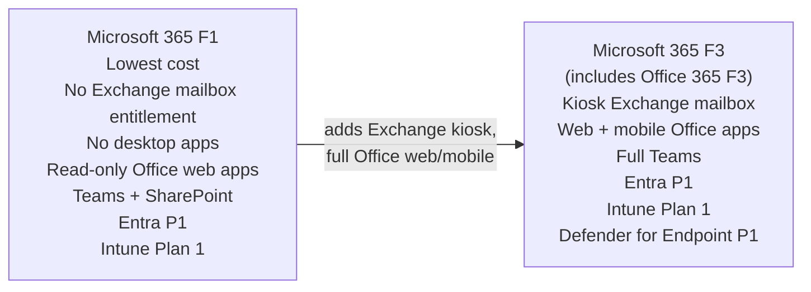

# 05 — Frontline Licensing (F1 / F3)

> Back to [Index](00-index.md)

---

## What Is a Frontline Worker?

A **frontline worker** (also called a "deskless worker") is someone who:
- Does not have a dedicated desk or computer
- Uses shared devices, kiosks, or personal mobile devices
- Needs task management, shift scheduling, communication — but not full desktop Office
- Examples: retail associates, healthcare staff, manufacturing workers, field technicians, warehouse staff

Microsoft licenses these users at a much lower price point, but with significant restrictions on which apps and device experiences are available.

---

## Frontline Plan Overview

---

## Microsoft 365 F1

**Target audience:** Frontline workers who need basic communication and task apps but NO email or document creation.

| Capability | F1 |
|-----------|-----|
| Exchange mailbox | ❌ (Exchange Online K1 provisioned but no entitlement to use it) |
| Outlook / Email client | ❌ |
| SharePoint | ✅ (access/view; contribute depends on license scope) |
| OneDrive | ✅ 2 GB only |
| Teams | ✅ (messaging, meetings, calls, Tasks by Planner, Shifts, Walkie Talkie) |
| Office web apps | Read-only (can view files; no create/edit/save rights) |
| Desktop Office apps | ❌ |
| Mobile Office apps | ❌ |
| Microsoft Entra ID | P1 (included) |
| Conditional Access | ✅ (via Entra P1) |
| Intune | Plan 1 (MDM/MAM for device management) |
| Defender for Endpoint | ❌ |
| Defender for Office 365 | EOP only |
| Purview | Audit Standard, basic compliance |
| Windows Enterprise | ❌ |

> **F1 email clarification:** Microsoft 365 F1 provisions an Exchange Online K1 service plan at the tenant level (to enable Teams calendar), but users are NOT entitled to use Exchange as an email mailbox. Microsoft explicitly recommends administrators disable Outlook on the web for F1 users and instruct them not to access Exchange via other methods.

---

## Microsoft 365 F3

**Target audience:** Frontline workers who need a kiosk-style email, full mobile/web Office, and Teams — but still don't need desktop apps or full enterprise productivity.

| Capability | F3 |
|-----------|-----|
| Exchange Online | Kiosk (2 GB mailbox, webmail access, basic email) |
| Outlook web access | ✅ (kiosk tier) |
| SharePoint | ✅ |
| OneDrive | ✅ 2 GB |
| Teams | ✅ full |
| Office web apps | ✅ (create, edit, save) |
| Office mobile apps | ✅ |
| Desktop Office apps | ❌ |
| Microsoft Entra ID | P1 |
| Conditional Access | ✅ |
| Intune | Plan 1 |
| Defender for Endpoint | P1 |
| Defender for Office 365 | EOP only |
| Purview | Audit Standard, basic compliance |
| Windows Enterprise | ❌ |

---

## Office 365 F3 (Standalone)

Office 365 F3 is a standalone productivity-only plan for frontline workers. It does NOT include Entra P1, Intune, Defender for Endpoint P1, or Windows.

| Feature | Office 365 F3 | Microsoft 365 F3 |
|---------|--------------|-----------------|
| Exchange kiosk | ✅ | ✅ |
| SharePoint / Teams | ✅ | ✅ |
| Office web/mobile | ✅ | ✅ |
| Entra ID P1 | ❌ | ✅ |
| Intune | ❌ | ✅ (Plan 1) |
| Defender for Endpoint P1 | ❌ | ✅ |
| Windows Enterprise | ❌ | ❌ |

---

## F1/F3 vs E3 — When to Use Frontline Plans

| Question | F1/F3 appropriate | E3 appropriate |
|---------|------------------|---------------|
| Does the user need desktop Office? | No → F1/F3 | Yes → E3 |
| Does the user need a full email mailbox? | No (F1), Light (F3) → use F | Yes → E3 |
| Is the user on shared/kiosk devices? | Yes → F | No (dedicated device) → E3 |
| Does the user create documents regularly? | No → F1, Light → F3 | Yes → E3 |
| Does the org manage endpoints (MDM)? | F3 includes Intune | E3 includes Intune |
| Advanced security needs? | F3 has MDE P1 | E3 has MDE P1 |
| Advanced compliance? | Add F5 add-ons | Add Purview Suite |

### F5 Add-on
The **Microsoft 365 F5 Security** and **Microsoft 365 F5 Compliance** add-ons extend F1/F3 with E5-equivalent security and compliance capabilities for frontline workers. These are the frontline worker equivalents of upgrading to E5:
- **F5 Security** = Defender for Endpoint P2, Defender for Office 365 P2, Defender for Identity, Defender for Cloud Apps, Entra P2 for frontline users
- **F5 Compliance** = Full Purview Suite capabilities for frontline users

---

## Frontline Licensing Gotchas

> ⚠️ **Gotcha 1:** F1 users cannot send/receive email. If you assign F1 and users try to use Outlook, they are violating the license terms.

> ⚠️ **Gotcha 2:** OneDrive storage for F1/F3 is only 2 GB per user, compared to 1 TB for E3/E5. This matters for document collaboration.

> ⚠️ **Gotcha 3:** F1/F3 users with Intune can have their devices enrolled in MDM, but they still need appropriate Microsoft 365 app licenses to use those apps on enrolled devices.

> ⚠️ **Gotcha 4:** If an organization has some E3 users and some F3 users sharing SharePoint sites, the Purview policies applied to the site require each user with owner/member access to have the appropriate Purview license — F3 users are only covered for basic Purview features.

---

## Sources

- [Microsoft Learn — M365 plan options (service table)](https://learn.microsoft.com/en-us/office365/servicedescriptions/office-365-platform-service-description/office-365-plan-options)
- [Microsoft — F1 mailbox note](https://learn.microsoft.com/en-us/office365/servicedescriptions/office-365-platform-service-description/office-365-plan-options#service-availability-within-each-microsoft-365-and-office-365-plan)
- [Microsoft Learn — Intune licensing](https://learn.microsoft.com/en-us/intune/fundamentals/licensing)
