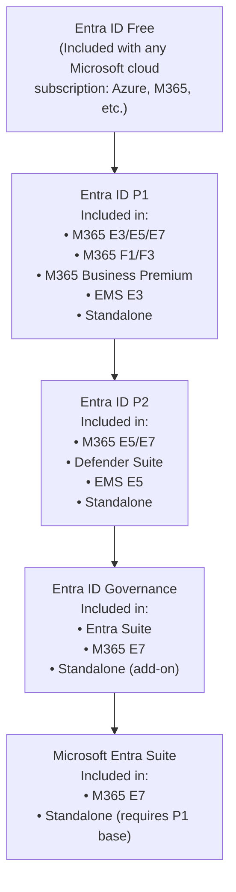

# 06 — Microsoft Entra Licensing

> Back to [Index](00-index.md)

---

## What Is Microsoft Entra?

Microsoft Entra is Microsoft's **identity and network access** product family. It was previously called "Azure Active Directory" (Azure AD) until a rebrand in 2023. The Entra family now includes:
- Identity (Entra ID) — the core identity directory
- Governance (Entra ID Governance) — lifecycle and access management
- Network access (Entra Private Access + Internet Access) — zero trust network access
- Verified credentials (Entra Verified ID)
- Agent identity (Entra Agent ID) — identity for AI agents

---

## Entra Licensing Hierarchy

---

## Microsoft Entra ID Free

**What it is:** The basic identity directory included automatically with any Microsoft cloud subscription (Azure, Microsoft 365, Dynamics 365).

| Feature | Free |
|---------|------|
| Cloud-based identity directory | ✅ |
| User and group management | ✅ |
| Single sign-on (SSO) for Microsoft apps | ✅ |
| Basic MFA (Microsoft Authenticator app, SMS) | ✅ (via Security Defaults) |
| Security Defaults (tenant-wide MFA enforcement) | ✅ |
| SSPR (cloud-only accounts) | ✅ |
| Application provisioning (basic) | ✅ |
| Audit logs | ✅ |
| Sign-in logs | ✅ |
| B2B collaboration | ✅ |
| Custom domains | ✅ |
| Conditional Access | ❌ |
| Dynamic groups | ❌ |
| Admin control over verification methods | ❌ |

> **Security Defaults vs Conditional Access:** Security Defaults provide basic MFA for all users at the tenant level with no customization. Conditional Access (P1) allows granular policy-based access control: "MFA required for all users except from trusted IPs" or "Block access to email from non-compliant devices."

---

## Microsoft Entra ID P1

**What it is:** The identity tier included in most Microsoft 365 enterprise and business plans. Provides the controls that most IT organizations expect as baseline.

**Included in:** M365 E3, M365 E5, M365 E7, M365 F1, M365 F3, M365 Business Premium, EMS E3, EMS E5

**Available as:** Standalone subscription

| Feature | P1 |
|---------|-----|
| All Free features | ✅ |
| Conditional Access (policy-based) | ✅ |
| Dynamic groups | ✅ |
| SSPR with writeback (hybrid) | ✅ |
| MFA — all methods (phone call, SMS, app, FIDO2) | ✅ |
| Admin control over MFA verification methods | ✅ |
| Custom greetings and caller ID for phone calls | ✅ |
| Trusted IPs (named locations) | ✅ |
| Fraud alert | ✅ |
| Application proxy (publish on-premises apps) | ✅ |
| HR-driven provisioning | ✅ |
| API-driven provisioning | ✅ |
| Cross-tenant synchronization | ✅ |
| Identity Governance dashboard | ✅ |
| Terms of use attestation | ✅ |
| Custom roles (RBAC) | ✅ |
| Administrative units | ✅ |
| Connect Health (hybrid monitoring) | ✅ |
| Risk-based Conditional Access | ❌ (P2) |
| Privileged Identity Management (PIM) | ❌ (P2) |
| Identity Protection (risky sign-ins) | ❌ (P2) |
| Access Reviews | ❌ (P2) |
| Entitlement Management | ❌ (P2) |
| Lifecycle Workflows | ❌ (Governance) |

> **Common mistake:** Organizations upgrade to Business Premium or E3 and assume they have full identity governance. Conditional Access, dynamic groups, SSPR with writeback — yes. PIM, Access Reviews, Entitlement Management, Lifecycle Workflows — no. Those require P2 or Governance.

---

## Microsoft Entra ID P2

**What it is:** The advanced identity tier providing risk-adaptive security. Fundamentally changes the security model from "policy-based access" to "risk-based access."

**Included in:** M365 E5, M365 E7, Defender Suite, EMS E5

**Available as:** Standalone subscription

| Feature | P2 (adds over P1) |
|---------|------------------|
| **Identity Protection** | Detect risky sign-ins and risky users based on behavioral signals and threat intelligence |
| **Risk-based Conditional Access** | "Block access when sign-in risk is high" or "require MFA when user risk is medium or above" |
| **Privileged Identity Management (PIM)** | Just-in-time role activation; approval workflows; audit trail for privileged access |
| **PIM for Groups** | Extend PIM to Azure AD groups (not just roles) |
| **Access Reviews** | Periodic reviews of who has access to what; auto-revoke if not reviewed |
| **Entitlement Management** | Access packages: bundle multiple resources and let users self-request time-limited access |
| Risky users report (full details) | ✅ |
| Risky sign-ins report (full details) | ✅ |
| MFA registration policy | ✅ |

### PIM — Why It Matters
Without PIM: Privileged roles are permanently assigned. An admin is always a Global Admin.
With PIM: Privileged roles are *eligible*, not permanently active. When an admin needs to do privileged work, they *activate* the role for a limited time (e.g., 1 hour) with MFA + justification + optional approval. After the time expires, the role is deactivated.

### Who Needs P2 Licensing for PIM?
- Users with eligible or time-bound assignments to Azure AD roles managed through PIM
- Users who approve or reject role activation requests
- Users assigned to access reviews

> **Licensing gotcha:** PIM is scoped per-user. If you have 10 admins managed through PIM in a 500-user tenant, you need 10 P2 licenses (for the admins), not 500. But the admins must have P2 — Free or P1 alone is not sufficient.

### Entitlement Management — What It Is
Entitlement Management lets you create **access packages** — bundles of permissions (SharePoint sites + Teams channels + app access) that users can request through a self-service portal. Approvers are notified, and access can be time-limited and auto-revoked.

- Requires P2 for basic entitlement management features
- Advanced features (auto-assignment policies, Logic App integration, Verified ID integration) require Governance or Entra Suite

---

## Microsoft Entra ID Governance

**What it is:** A product that extends P2 with advanced lifecycle management, advanced access review capabilities, and advanced entitlement management. **Not to be confused with "governance" as a general concept.**

**Included in:** Entra Suite, M365 E7

**Available as:** Standalone add-on (requires P1 or P2 base)

| Feature | Governance adds (over P2) |
|---------|--------------------------|
| **Lifecycle Workflows** | Automated joiner/mover/leaver workflows triggered by HR data changes (e.g., new hire → add to groups → provision apps → send welcome email) |
| Lifecycle Workflows with Custom Extensions (Logic Apps) | ✅ |
| Advanced Access Review capabilities | PIM for Groups in reviews; reviews scoped to inactive users; ML-assisted recommendations |
| Catalog Access Reviews | ✅ |
| Auto-Assignment Policies in Entitlement Management | ✅ |
| Sponsors as approvers | ✅ |
| Managers requesting on behalf | ✅ |
| Externally determine approval requirements (Logic Apps) | ✅ |
| Verified ID integration in entitlement | ✅ |
| IRM (Insider Risk) integration in entitlement | ✅ |
| Cross-cloud synchronization for groups | ✅ |
| Insights on inactive guest accounts | ✅ |
| PIM custom extensions | ✅ |

> **Governance vs Governance features in P2:** Access Reviews exist in P2. But advanced access review features (ML-assisted recommendations, PIM for Groups reviews, inactive-user scoping) require Governance. Similarly, Entitlement Management exists in P2, but Auto-Assignment Policies and Sponsor approval workflows require Governance.

---

## Microsoft Entra Suite

**What it is:** A combined license that includes five products: Entra Private Access, Entra Internet Access, Entra ID Governance, Entra ID Protection, and Entra Verified ID premium.

**Included in:** M365 E7

**Available as:** Standalone ($12/user/month) — requires Entra ID P1 as prerequisite

### Five Products in the Entra Suite

#### 1. Microsoft Entra Private Access
**What it replaces:** Legacy VPN for accessing private/on-premises applications
**How it works:** Zero Trust Network Access (ZTNA) — users connect to specific applications through a secure tunnel, not the entire network. Identity-aware: access is conditioned on user + device compliance + risk.
**Use case:** Replace Cisco AnyConnect/GlobalProtect with identity-based access to SAP, HR systems, internal websites

#### 2. Microsoft Entra Internet Access
**What it replaces:** Web proxies, basic web filtering
**How it provides:** Secure Web Gateway (SWG) + URL filtering + threat protection for web traffic + **AI Gateway** (inspect and govern LLM/AI API traffic)
**Use case:** Enforce web access policies for remote workers; inspect AI API calls from copilots and agents

#### 3. Microsoft Entra ID Governance
Full Lifecycle Workflows + advanced access review and entitlement capabilities (as described above).

#### 4. Microsoft Entra ID Protection
The P2-level risk detection capabilities:
- Risky sign-in detection
- Risky user detection
- Risk-based Conditional Access

#### 5. Microsoft Entra Verified ID (premium — Face Check)
**What it is:** Microsoft's decentralized identity platform that lets organizations issue and verify verifiable credentials.
**Face Check:** Premium capability that allows identity verification using a selfie + a verifiable credential during high-assurance authentication flows.
**Core Verified ID** (issuance/verification of credentials) is free at all Entra tiers. Face Check is the premium add-on included in the Suite.

---

## Entra P2 vs Entra ID Governance vs Entra Suite — Clear Distinction

| Capability | P2 | Governance | Suite |
|-----------|-----|-----------|-------|
| Risk-based Conditional Access | ✅ | ✅ | ✅ |
| Identity Protection | ✅ | ✅ | ✅ |
| PIM (just-in-time roles) | ✅ | ✅ | ✅ |
| Access Reviews (basic) | ✅ | ✅ | ✅ |
| Entitlement Management (basic) | ✅ | ✅ | ✅ |
| **Lifecycle Workflows** | ❌ | ✅ | ✅ |
| **Advanced Access Reviews** (ML, inactive users, PIM for Groups) | ❌ | ✅ | ✅ |
| **Auto-Assignment Policies** | ❌ | ✅ | ✅ |
| **Sponsor approvers** | ❌ | ✅ | ✅ |
| **Entra Private Access** (ZTNA) | ❌ | ❌ | ✅ |
| **Entra Internet Access** (SWG) | ❌ | ❌ | ✅ |
| **Verified ID — Face Check** | ❌ | ❌ | ✅ |
| Agent identity / Agent CA | ❌ | ❌ | ✅ (with Agent 365) |

> **Plain-English summary:**
> - **P2** = risk-aware identity and just-in-time privilege
> - **Governance** = P2 + joiner/mover/leaver automation and advanced access lifecycle
> - **Suite** = Governance + network access (ZTNA + SWG) + verified identity premium + agent identity

---

## Which Plans Include Which Entra Tier?

| License | Entra Tier |
|---------|-----------|
| Microsoft 365 Business Basic / Standard | Free |
| Microsoft 365 Business Premium | **P1** |
| Office 365 E1/E3/E5 | Free or very basic |
| Microsoft 365 E1 | Free/P1 (verify with Microsoft) |
| Microsoft 365 E3 | **P1** |
| Microsoft 365 F1 | **P1** |
| Microsoft 365 F3 | **P1** |
| EMS E3 | **P1** |
| Microsoft 365 E5 | **P2** |
| EMS E5 | **P2** |
| Defender Suite | **P2** |
| Entra Suite (standalone) | **Full Suite** (requires P1 base) |
| Microsoft 365 E7 | **Full Suite** (included) |

---

## Agent Identity — Microsoft Entra Agent ID

As AI agents proliferate, organizations need to manage agent identities the way they manage user identities. **Microsoft Entra Agent ID** is the platform for creating and managing agent identities and agent identity blueprints.

- **Entra Agent ID basic:** Available at no additional cost to all Entra customers (create and manage agent identities)
- **Conditional Access for agents:** Requires Microsoft Agent 365 license
- **Agent access packages / entitlement management:** Requires Microsoft Agent 365
- **Agent Security Posture Management:** Requires Microsoft Agent 365 (included in E7)

---

## Sources

- [Microsoft Learn — Entra licensing](https://learn.microsoft.com/en-us/entra/fundamentals/licensing)
- [Microsoft Learn — Entra ID Governance licensing fundamentals](https://learn.microsoft.com/en-us/entra/id-governance/licensing-fundamentals)
- [Microsoft — Entra pricing](https://www.microsoft.com/en-us/security/business/microsoft-entra-pricing)
- [Microsoft Learn — E3/E5/E7 Entra feature comparison](https://learn.microsoft.com/en-us/microsoft-365/copilot/microsoft-365-copilot-license-feature-overview)
