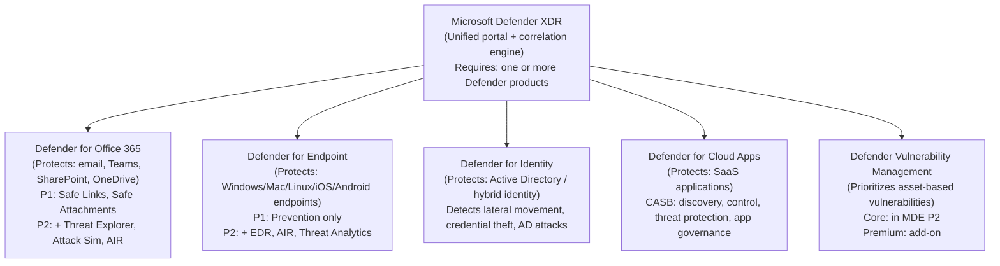

# 07 — Microsoft Defender Licensing

> Back to [Index](00-index.md)

---

## Microsoft Defender Is an Ecosystem, Not One License

"Microsoft Defender" is a brand name covering multiple distinct security products. Each product protects a different surface area and has its own license tiers.

---

## Microsoft Defender for Office 365 (MDO)

**What it protects:** Email (Exchange Online), Microsoft Teams, SharePoint Online, OneDrive for Business

**What problem it solves:** Phishing, malware attachments, zero-day exploits delivered via email or collaboration tools. Exchange Online Protection (EOP) provides basic email hygiene (anti-spam, basic anti-malware). MDO adds advanced threat protection.

### Plan 1 vs Plan 2

| Capability | MDO P1 | MDO P2 |
|-----------|--------|--------|
| Safe Links (URL scanning/rewriting) | ✅ | ✅ |
| Safe Attachments (detonation sandbox) | ✅ | ✅ |
| Safe Attachments for SharePoint/OneDrive/Teams | ✅ | ✅ |
| Anti-phishing (impersonation, spoof protection) | ✅ | ✅ |
| Real-time detections | ✅ | ✅ |
| Threat Trackers | ❌ | ✅ |
| Campaign Views | ❌ | ✅ |
| Threat Explorer (historical hunting) | ❌ | ✅ |
| Automated Investigation & Response (AIR) | ❌ | ✅ |
| Attack Simulation Training | ❌ | ✅ |
| Microsoft Defender XDR integration | Partial | ✅ Full |

### Which Plans Include MDO?

| Plan | MDO tier |
|------|---------|
| Microsoft 365 E3 | ❌ (EOP only) |
| Microsoft 365 Business Premium | P1 |
| Microsoft 365 E5 | **P2** |
| Office 365 E5 | **P2** |
| Microsoft Defender Suite | **P2** |
| MDO P1 standalone | **P1** |
| MDO P2 standalone | **P2** |

### Licensing Scope
Users must be licensed for MDO to benefit from its protections. If Safe Links protection is enabled, all users who access Teams, SharePoint, OneDrive, or use Microsoft 365 apps need a MDO license. Shared mailboxes that receive external email also need a MDO license.

---

## Microsoft Defender for Endpoint (MDE)

**What it protects:** Endpoint devices — Windows (7/10/11), macOS, Linux, iOS, Android

**What problem it solves:** Advanced persistent threats on endpoints; ransomware; fileless attacks. MDE P1 is prevention-focused. MDE P2 adds visibility into what happened after an attack starts and automation to respond.

### Plan 1 vs Plan 2

| Capability | MDE P1 | MDE P2 |
|-----------|--------|--------|
| Next-generation antimalware | ✅ | ✅ |
| Attack Surface Reduction (ASR) rules | ✅ | ✅ |
| Device control (USB policies) | ✅ | ✅ |
| Endpoint firewall | ✅ | ✅ |
| Network protection | ✅ | ✅ |
| Application control (AppLocker/WDAC) | ✅ | ✅ |
| Web content filtering | ✅ | ✅ |
| **Endpoint Detection & Response (EDR)** | ❌ | ✅ |
| **Automated Investigation & Remediation (AIR)** | ❌ | ✅ |
| **Threat & Vulnerability Management (TVM)** | ❌ | ✅ (core) |
| **Threat Analytics** | ❌ | ✅ |
| **Advanced Hunting** | ❌ | ✅ |
| **Device sandbox (Deep Analysis)** | ❌ | ✅ |
| **Microsoft Threat Experts** | ❌ | ✅ |
| Defender XDR integration | Partial | ✅ Full |

### The EDR Difference — Why It Matters
- **Without EDR (P1):** You can prevent known threats. If a novel threat gets through, you don't know what it did, where it went, or how to contain it.
- **With EDR (P2):** You get a timeline of everything that happened on an endpoint — process trees, file changes, network connections. You can see the full attack chain, isolate the device, and automate remediation.

### Which Plans Include MDE?

| Plan | MDE tier |
|------|---------|
| Microsoft 365 E3 | **P1** |
| Microsoft 365 F3 | **P1** |
| Microsoft 365 Business Premium | Defender for Business (simplified, SMB) |
| Microsoft 365 E5 | **P2** |
| Windows 11/10 Enterprise E5 | **P2** |
| Microsoft Defender Suite | **P2** |
| MDE P1 standalone | **P1** |
| MDE P2 standalone | **P2** |
| Microsoft 365 E7 | **P2** |

> **Defender for Business vs MDE P1 vs MDE P2:** Defender for Business (Business Premium) is designed for ≤300-user SMBs with a simplified management experience. MDE P1 is the enterprise version of prevention-only endpoint security. MDE P2 is the full enterprise endpoint security platform. They are different products with different management experiences.

### Server Licensing
MDE user licenses cover **up to 5 devices per user** but do NOT cover servers. Servers require a separate **Microsoft Defender for Endpoint for Servers** license (per Operating System Environment/OSE). Servers can also be protected via Microsoft Defender for Cloud (formerly Azure Defender for Servers).

---

## Microsoft Defender for Identity (MDI)

**What it protects:** Active Directory (on-premises) and hybrid identity environments

**What problem it solves:** Attackers who compromise an Active Directory domain can move laterally, escalate privileges, and eventually take over the entire organization. MDI detects these AD-based attack patterns:
- Pass-the-Hash / Pass-the-Ticket
- Kerberoasting
- Golden Ticket attacks
- Lateral movement paths
- Reconnaissance and domain enumeration
- Compromised credential use

**How it works:** MDI installs sensors on domain controllers (or reads from existing sensors) and analyzes AD traffic for attack patterns.

### Licensing
| Plan | MDI |
|------|-----|
| Microsoft 365 E5 | ✅ |
| EMS E5 | ✅ |
| Microsoft Defender Suite | ✅ |
| Microsoft 365 E7 | ✅ |
| MDI standalone | ✅ (per user) |

MDI is a per-user subscription license. All users in the environment benefit from it (tenant-wide protection), but licenses must be purchased for the users being protected.

---

## Microsoft Defender for Cloud Apps (MDCA)

**What it protects:** Cloud SaaS applications (Microsoft 365, Salesforce, ServiceNow, Box, Dropbox, Google Workspace, and 16,000+ other apps)

**What problem it solves:** Shadow IT (unauthorized apps used by employees), OAuth token abuse, data exfiltration through SaaS apps, compliance gaps in SaaS data.

### Key Capabilities

| Capability | Description |
|-----------|-------------|
| **Cloud Discovery** | Identify all cloud apps being used by analyzing traffic logs or Defender for Endpoint data |
| **App governance** | Govern OAuth apps registered in Entra that may have excessive permissions |
| **Conditional Access App Control** | Real-time session monitoring and policy enforcement for cloud apps (requires Entra P1) |
| **Information Protection** | Scan SaaS apps for sensitive data; apply labels; prevent data exfiltration |
| **Threat Protection** | Detect anomalous behavior in SaaS apps (unusual data download, impossible travel) |

### Basic Discovery (E3) vs Full MDCA (E5)
- **E3 users:** Get "basic Shadow IT discovery" — limited visibility into cloud app usage
- **E5 / Defender Suite users:** Get full Defender for Cloud Apps — discovery, control, governance, threat protection, Conditional Access App Control

### Which Plans Include MDCA?

| Plan | MDCA tier |
|------|----------|
| Microsoft 365 E3 | Basic cloud discovery only |
| Microsoft 365 E5 | ✅ Full |
| EMS E5 | ✅ Full |
| Microsoft Defender Suite | ✅ Full |
| Microsoft Purview Suite | ✅ Full |
| Microsoft 365 E5 Information Protection & Governance | ✅ Full |
| MDCA standalone | ✅ Full |
| Microsoft 365 E7 | ✅ Full |

> **Note:** Conditional Access App Control in MDCA requires Entra ID P1 (which is included in all E3+ plans). Automatic client-side labeling in MDCA requires AIP P2 (which is in E5 and EMS E5).

---

## Microsoft Defender XDR

**What it is:** NOT a separate product or license. Defender XDR is the **unified security portal and correlation engine** (at security.microsoft.com) that brings together signals from all Defender products.

**What it does:**
- Correlates alerts across email, endpoint, identity, and cloud apps into unified incidents
- Provides cross-product investigation
- Enables automated response across multiple surfaces
- Powers Microsoft Defender Threat Intelligence (MDTI)
- Enables Advanced Hunting across all Defender data sources (requires appropriate Defender licenses)

**Licensing:** You access Defender XDR capabilities when you have one or more qualifying Defender products. The more Defender products you have, the more correlated the XDR experience becomes. E5 (with all four Defender products) delivers the fullest XDR experience.

---

## Microsoft Defender Suite (Add-on)

The **Microsoft Defender Suite** is a security-focused add-on that provides E5-equivalent security capabilities WITHOUT the productivity or compliance components of Microsoft 365 E5.

**Commonly used as:** `Microsoft 365 E3 + Microsoft Defender Suite ≈ E5 security posture` (not compliance)

| Component | Included in Defender Suite |
|-----------|--------------------------|
| Defender for Office 365 **P2** | ✅ |
| Defender for Endpoint **P2** | ✅ |
| Defender for Identity | ✅ |
| Defender for Cloud Apps (full) | ✅ |
| Entra ID **P2** | ✅ |
| Microsoft Defender XDR (full) | ✅ |
| Security Copilot | ✅ (via E5 entitlement) |
| Advanced Purview (Insider Risk, eDiscovery Premium, etc.) | ❌ (add Purview Suite for compliance) |
| Microsoft 365 Copilot | ❌ |
| Agent 365 | ❌ |
| Entra Suite (Private Access, etc.) | ❌ |

**Prerequisites:** Requires Microsoft 365 E3 (or Office 365 E3 + EMS E3) as the base license.

### Defender Suite for Frontline Workers (FLW)
- **Microsoft Defender Suite FLW:** Defender for Endpoint P2, Defender for Office 365 P2, Defender for Identity, Entra ID P2 — for F1/F3 users
- **Microsoft Defender + Purview Suite FLW:** Defender Suite FLW + full Purview Suite capabilities for frontline workers

---

## Defender Vulnerability Management

**What it is:** A specialized vulnerability management product that identifies, prioritizes, and recommends remediation for software vulnerabilities across your endpoints.

| Tier | What's included | Where |
|------|----------------|-------|
| **Core** | Asset inventory, vulnerability discovery, basic recommendations | Included in MDE P2 |
| **Premium** | Advanced assessment capabilities, browser extension scanning, certificate assessment, advanced hunting for vulnerabilities | Add-on to MDE P2 |
| **Standalone** | Full vulnerability management for organizations without MDE P2 | Standalone purchase |

---

## E3 vs E5 vs Defender Suite — Security Summary

| Security capability | M365 E3 | M365 E5 | M365 E3 + Defender Suite |
|--------------------|---------|---------|--------------------------|
| Defender for Endpoint | P1 | P2 | P2 |
| Defender for Office 365 | EOP only | P2 | P2 |
| Defender for Identity | ❌ | ✅ | ✅ |
| Defender for Cloud Apps | Basic | Full | Full |
| Entra ID | P1 | P2 | P2 |
| Security Copilot | ❌ | ✅ | ✅ |
| Advanced Purview | ❌ | ✅ | ❌ |
| Windows Enterprise | E3 | E5 | E3 (from base) |
| Productivity (desktop Office, etc.) | ✅ | ✅ | ✅ (from E3 base) |

---

## Sources

- [Microsoft Learn — Defender service description](https://learn.microsoft.com/en-us/office365/servicedescriptions/microsoft-365-service-descriptions/microsoft-365-tenantlevel-services-licensing-guidance/microsoft-defender-service-description)
- [Microsoft Learn — Defender for Endpoint (product page)](https://learn.microsoft.com/en-us/defender-endpoint/microsoft-defender-endpoint)
- [Microsoft Learn — Defender XDR overview](https://learn.microsoft.com/en-us/defender-xdr/microsoft-365-defender)
- [Microsoft — Defender Suite](https://www.microsoft.com/en-us/security/microsoft-defender-suite)
- [Microsoft — Defender pricing](https://www.microsoft.com/en-us/security/microsoft-defender-pricing)
- [Microsoft Learn — Security Copilot inclusion in E5/E7](https://learn.microsoft.com/en-us/copilot/security/security-copilot-inclusion)
