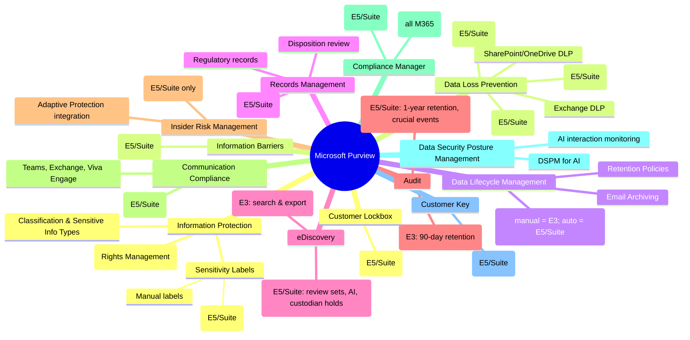
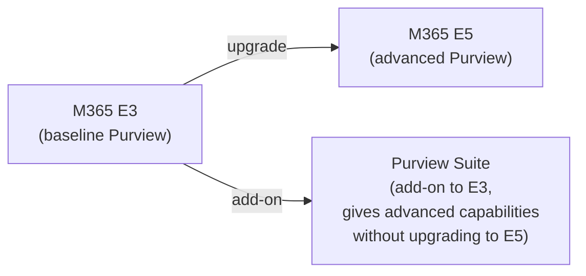
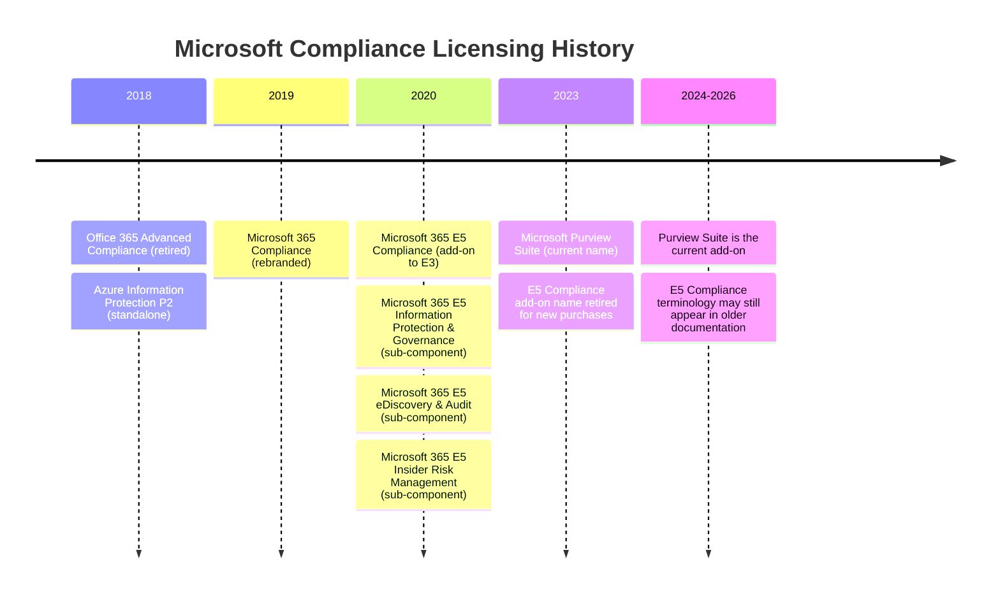

# 08 — Microsoft Purview Licensing

> Back to [Index](00-index.md)

---

## What Is Microsoft Purview?

Microsoft Purview is NOT one product and NOT one license. It is Microsoft's brand name for a family of **data security, compliance, and governance** products.



---

## The Key Principle: Which Purview Capabilities Are in Which License?



---

## Detailed Capability Matrix

### Audit

| Feature | M365 E3 | O365 E3 | M365 E5 | Purview Suite | Business Premium |
|---------|---------|---------|---------|--------------|----------------|
| **Audit Standard** | ✅ 90-day | ✅ 90-day | ✅ | ✅ | ✅ |
| **Audit Premium** (1-year retention, crucial events, high-bandwidth API) | ❌ | ❌ | ✅ | ✅ | ❌ (needs add-on) |
| 10-year audit retention | ❌ | ❌ | Add-on | Add-on | ❌ |
| Copilot interaction audit | ✅ (if Copilot licensed) | ✅ | ✅ | ✅ | ✅ |

### eDiscovery

| Feature | M365 E3 | O365 E3 | M365 E5 | Purview Suite |
|---------|---------|---------|---------|--------------|
| **eDiscovery Standard** (search, export) | ✅ | ✅ | ✅ | ✅ |
| **eDiscovery Premium** (review sets, custodian hold, AI-assisted review, advanced export, deep analysis) | ❌ | ❌ | ✅ | ✅ |

### Sensitivity Labels (Information Protection)

| Feature | M365 E3 | M365 E5 | Purview Suite |
|---------|---------|---------|--------------|
| Create custom labels | ✅ | ✅ | ✅ |
| Manual label application | ✅ | ✅ | ✅ |
| **Auto-apply labels** (based on content inspection) | ❌ | ✅ | ✅ |
| Default labels and policies | ❌ | ✅ | ✅ |
| Container labels (SharePoint sites, Teams) | ❌ | ✅ | ✅ |
| Encryption via RMS | ✅ (manual; requires AIP P1) | ✅ | ✅ |
| Auto-labeling with AIP P2 | ❌ | ✅ | ✅ |
| DSPM for AI visibility | Basic | ✅ Full | ✅ Full |

### Data Loss Prevention (DLP)

| Feature | M365 E3 | M365 E5 | Purview Suite |
|---------|---------|---------|--------------|
| Exchange DLP | ✅ | ✅ | ✅ |
| SharePoint/OneDrive DLP | ✅ | ✅ | ✅ |
| **Teams DLP** | ❌ | ✅ | ✅ |
| **Endpoint DLP** (Windows 10/11 endpoints) | ❌ | ✅ | ✅ |
| **Adaptive Protection** (DLP + Insider Risk integration) | ❌ | ✅ | ✅ |
| DLP for Copilot/Agent interactions | ❌ | ❌ | ❌ (E7 only) |

### Data Lifecycle Management & Records Management

| Feature | M365 E3 | M365 E5 | Purview Suite |
|---------|---------|---------|--------------|
| Retention policies (org-wide/location-wide) | ✅ | ✅ | ✅ |
| Retention labels (manual) | ✅ | ✅ | ✅ |
| **Auto-apply retention labels** | Basic (E3 limited) | ✅ | ✅ |
| **Adaptive policy scope** | ❌ | ✅ | ✅ |
| **Event-based retention** | ❌ | ✅ | ✅ |
| **Disposition review** | ❌ | ✅ | ✅ |
| **Records Management (full)** | Basic | ✅ | ✅ |
| Regulatory records | ❌ | ✅ | ✅ |

### Insider Risk Management

| Feature | M365 E3 | M365 E5 | Purview Suite |
|---------|---------|---------|--------------|
| Insider Risk Management (detect risky user behavior) | ❌ | ✅ | ✅ |
| Communication Compliance | ❌ | ✅ | ✅ |
| Adaptive Protection (IRM + DLP integration) | ❌ | ✅ | ✅ |
| Information Barriers | ❌ | ✅ | ✅ |

### Advanced Protection

| Feature | M365 E3 | M365 E5 | Purview Suite |
|---------|---------|---------|--------------|
| Customer Key | ❌ | ✅ | ✅ |
| Customer Lockbox | ❌ | ✅ | ✅ |
| Data Connectors (third-party data import) | ❌ | ✅ | ✅ |
| Privileged Access Management | ❌ | ✅ | ✅ |

---

## Microsoft Purview Suite — The Add-on Explained

**What it is:** An add-on license that brings advanced Purview capabilities to organizations that don't want to upgrade to E5.

**Prerequisites:** 
- Microsoft 365 E3, OR
- Office 365 E3 + Enterprise Mobility + Security E3

**What it includes:** Information Protection, DLP (full scope), eDiscovery Premium, Insider Risk Management, Audit Premium, Communication Compliance, Records Management (advanced), Compliance Manager (advanced), Customer Key, Customer Lockbox, Information Barriers, Data Connectors, Privileged Access Management

**What it does NOT include:** Microsoft 365 Copilot, Security Copilot, Defender products, Entra upgrades, Windows upgrades

> **Common mistake:** Purview Suite is NOT the same as Microsoft 365 E5 Compliance (a legacy add-on name). See the Legacy SKUs section below.

---

## Business Premium + Purview Suite

**What this achieves:** A Business Premium user with the Purview Suite add-on gets advanced compliance capabilities comparable to E5 compliance in a 300-seat SMB deployment.

| Capability | Business Premium | Business Premium + Purview Suite |
|-----------|----------------|----------------------------------|
| Audit Standard | ✅ | ✅ |
| Audit Premium | ❌ | ✅ |
| eDiscovery Standard | ✅ | ✅ |
| eDiscovery Premium | ❌ | ✅ |
| Insider Risk Management | ❌ | ✅ |
| Communication Compliance | ❌ | ✅ |
| Auto sensitivity labels | ❌ | ✅ |
| Endpoint DLP | ❌ | ✅ |
| Customer Lockbox | ❌ | ✅ |

> The Purview Suite for Business Premium add-on is capped at 300 seats (matching the Business plan limit).

---

## E3 + Purview Suite vs E5 — What's the Difference?

This is a critical question. E3 + Purview Suite and M365 E5 have overlapping but NOT identical Purview capabilities.

| Capability | E3 + Purview Suite | M365 E5 |
|-----------|-------------------|---------|
| All advanced Purview features | ✅ | ✅ |
| Defender for Endpoint P2 (EDR) | ❌ | ✅ |
| Defender for Identity | ❌ | ✅ |
| Defender for Cloud Apps (full) | ✅ (MDCA included in Purview Suite) | ✅ |
| Entra ID P2 (PIM, risk-based CA, Identity Protection) | ❌ (E3 has P1 only) | ✅ |
| Power BI Pro | ❌ | ✅ |
| Phone System / Audio Conferencing | ❌ | ✅ |
| Security Copilot | ❌ | ✅ |

**Conclusion:** E3 + Purview Suite gives you advanced compliance but NOT advanced identity or advanced endpoint security. E5 gives you all three. If you need compliance only (regulated content, eDiscovery, Insider Risk), E3 + Purview Suite may be more economical. If you need security AND compliance, E5 or E3 + Purview Suite + Defender Suite provides full coverage.

---

## Legacy Compliance SKUs {#legacy-compliance-skus}

Microsoft's compliance licensing has gone through several name changes. Here is the historical context:



### Legacy SKU Decoder

| Old Name | Current Status | Current Equivalent |
|----------|---------------|-------------------|
| **Office 365 Advanced Compliance** | Retired | Purview Suite |
| **Microsoft 365 Compliance** | Retired branding | Purview Suite |
| **Microsoft 365 E5 Compliance** | Legacy/retired add-on name | Purview Suite |
| **Microsoft 365 E5 Information Protection & Governance** | Legacy sub-component | Part of Purview Suite |
| **Microsoft 365 E5 eDiscovery & Audit** | Legacy sub-component | Part of Purview Suite |
| **Microsoft 365 E5 Insider Risk Management** | May still be sold separately | Still available as component |
| **Microsoft Purview Suite** | **Current** | The main compliance add-on |
| **Microsoft Information Protection (MIP)** | Renamed | Microsoft Purview Information Protection |

> **Why you see E5 Compliance in older docs:** Microsoft's licensing documentation still references E5 Compliance in some service descriptions because existing customers may still have those SKUs. Newer documentation uses "Microsoft Purview Suite." When you see "Microsoft 365 E5/A5/F5/G5 eDiscovery and Audit" in the Purview service description, this is a qualifying license name — not a new product. It refers to the specific component add-on that was historically available.

> **For new purchases as of September 2026:** Purchase **Microsoft Purview Suite** if you want advanced compliance as an add-on to E3. The component add-ons (E5 IRM, E5 eDiscovery & Audit, E5 IP&G) may still be available for organizations that need only specific capabilities, but the full Purview Suite is the recommended path.

---

## "Who Needs a Purview License?" — Practical Answers

This is more nuanced than "everyone in the org."

| Scenario | Who needs the license |
|---------|----------------------|
| **Audit Standard** | Users performing audited activities (all licensed M365 users get this) |
| **Audit Premium** | Users whose activities you want 1-year retention for |
| **eDiscovery Standard** | Users running searches; users whose content is searched (all M365 users) |
| **eDiscovery Premium** | Users running premium eDiscovery cases; custodians whose content is in custodian holds |
| **DLP (Exchange/SharePoint)** | Users whose mailboxes and files are subject to DLP policies |
| **Endpoint DLP** | Users whose Windows devices are subject to Endpoint DLP policies |
| **Insider Risk Management** | Users being monitored for insider risk |
| **Sensitivity Labels (manual)** | Users applying labels |
| **Auto-labeling** | Users whose files/emails are auto-labeled |
| **Communication Compliance** | Users whose communications are monitored |
| **SharePoint/Teams site DLP** | Site owners and members (not visitors) |
| **Retention policies** | Users whose content is retained |

> **Key rule from Microsoft:** "Any user benefiting from the service requires a license." For Purview, "benefiting" means your data is being protected, governed, or monitored by Purview policies. Administrators who configure policies but have no data in scope may have more limited licensing requirements, but in practice, most organizations license all users subject to Purview policies.

---

## Purview + Defender — The Relationship

Security and compliance overlap but serve different purposes:

```
Defender                              Purview
────────────────────                  ─────────────────────────
Protects against external             Protects data from internal
threats (malware, phishing,           risks (leakage, non-compliance,
ransomware, attackers)                policy violations, litigation)

Threat → Prevent → Detect             Data → Classify → Protect
          → Respond                           → Govern → Comply
```

**Example — Insider Risk:**
- A disgruntled employee starts downloading large amounts of sensitive files.
- **Purview Insider Risk Management** detects the behavioral pattern (large download + sensitivity label activity + termination date approaching) and raises an alert.
- **Purview DLP** with Adaptive Protection automatically tightens access restrictions for that user.
- **Defender for Cloud Apps** may also detect anomalous SaaS activity (exfiltration to personal Dropbox).

These products complement each other but are licensed separately.

---

## Sources

- [Microsoft Learn — Purview service description](https://learn.microsoft.com/en-us/office365/servicedescriptions/microsoft-365-service-descriptions/microsoft-365-tenantlevel-services-licensing-guidance/microsoft-purview-service-description)
- [Microsoft — Purview Suite](https://www.microsoft.com/en-us/security/microsoft-purview-suite)
- [Microsoft — Purview licensing guidance](https://www.microsoft.com/licensing/guidance/Microsoft-Purview)
- [Microsoft Learn — E3/E5/E7 Purview feature comparison](https://learn.microsoft.com/en-us/microsoft-365/copilot/microsoft-365-copilot-license-feature-overview)
- [Microsoft — Subscription suites licensing guidance](https://www.microsoft.com/licensing/guidance/subscription-suites)
