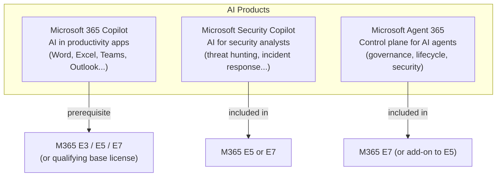
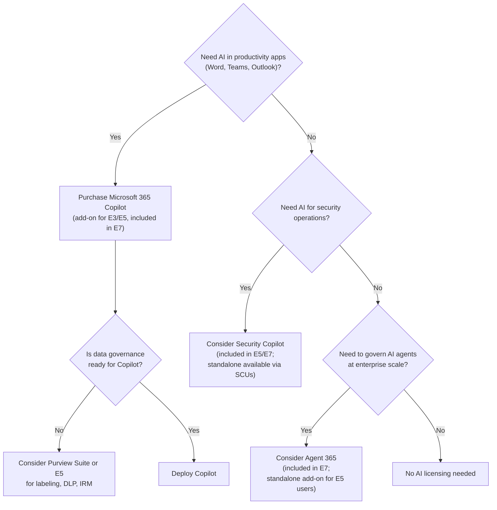

# 09 — Microsoft Copilot & Agent 365 Licensing

> Back to [Index](00-index.md)

---

## "Copilot" Is Not One License

Microsoft uses the "Copilot" name across multiple distinct products. Each has different prerequisites, scopes, and licensing.

---

## Microsoft 365 Copilot

**What it is:** An AI assistant integrated directly into Microsoft 365 apps. It uses large language models (LLMs) combined with your organization's Microsoft 365 data (emails, documents, meetings, chats) to assist with tasks.

**What it can do:**
- Draft, summarize, and rewrite in Word, Outlook, Teams, PowerPoint, Excel, OneNote, Loop, Clipchamp, Whiteboard, OneDrive, SharePoint
- Summarize missed Teams meetings or long email threads
- Generate Excel formulas and analyze data
- Create PowerPoint decks from prompts or Word documents
- Provide grounded answers using your org's Teams messages, emails, and files (Copilot Chat)
- Search across your Microsoft 365 data (Copilot Search)
- Create persistent working canvases (Copilot Notebooks, Copilot Pages)
- Build declarative agents with access to your org's data (SharePoint agents, Declarative Agents)

### Prerequisites for Microsoft 365 Copilot

Microsoft 365 Copilot requires one of the following base licenses:
- Microsoft 365 E3
- Microsoft 365 E5
- Microsoft 365 Business Standard
- Microsoft 365 Business Premium
- Microsoft 365 F3
- Microsoft 365 A3/A5 (education)

> For E3, E5, and Business users, Copilot is a paid add-on. For E7 users, Copilot is included.

### What Copilot Does NOT Automatically Give You

Purchasing Copilot does NOT automatically mean your data is ready for AI. Organizations typically need to:
1. Review sensitivity label coverage (ensure sensitive data is labeled)
2. Implement DLP policies to prevent oversharing
3. Review SharePoint permissions (oversharing is the #1 Copilot risk)
4. Purge stale data (Copilot surfaces old data too)
5. Configure audit logging for Copilot interactions

Microsoft recommends E5 or Purview Suite as complementary licenses to ensure data security when deploying Copilot.

### SharePoint Advanced Management (SAM)
SAM is automatically included with any Copilot license. It provides:
- Site ownership policies
- Site lifecycle management
- Data Access Governance (DAG) reports
- Restricted access control (RAC)
- Restricted content discoverability (RCD)

> **SAM note:** For E3 + Copilot add-on users, SAM is included with the Copilot license. For E7 users, SAM is included (Copilot is included). For E5 users without Copilot, SAM is available via the add-on.

### Copilot in E3 vs E5 vs E7

The core Copilot features (what it can do in apps) are the same across E3 + Copilot add-on, E5 + Copilot add-on, and E7 (included). The difference is in the **data security and governance context** Copilot operates in:

| Feature | E3 + Copilot | E5 + Copilot | E7 (Copilot included) |
|---------|-------------|-------------|----------------------|
| Copilot in all apps | ✅ | ✅ | ✅ |
| Copilot Chat (grounded in work data) | ✅ | ✅ | ✅ |
| Copilot Search, Notebooks, Pages | ✅ | ✅ | ✅ |
| SharePoint agents, Declarative Agents | ✅ | ✅ | ✅ |
| Auto sensitivity labeling protection | ❌ (E3 only has manual) | ✅ | ✅ |
| DLP extending to Copilot interactions | ❌ | ✅ (Exchange/SP/OD/Teams/Endpoints) | ✅ + Agent interactions |
| Audit Premium (Copilot interaction retention) | ❌ | ✅ | ✅ |
| Insider Risk — Copilot activity monitoring | ❌ | ✅ | ✅ |
| DSPM for AI (deep visibility) | Basic | ✅ Full | ✅ Full |
| Security Copilot | ❌ | ✅ | ✅ |
| Agent 365 (agent governance) | ❌ | Add-on | ✅ |

> **Plain-English meaning:** Copilot is equally capable across tiers in terms of what it can generate. But an E3 org deploying Copilot without upgrading security/compliance has more data risk exposure — if a document is overshared or mislabeled, Copilot surfaces it to unauthorized users. E5/E7 provides the auto-labeling, DLP, and audit infrastructure to govern Copilot more safely.

---

## Microsoft Security Copilot

**What it is:** An AI security analyst platform for security and IT operations teams. It uses GPT-4 with Microsoft's security-specific training and can be grounded in your organization's security data.

**Who it's for:** SOC analysts, incident responders, security architects, IT admins

**What it can do:**
- Investigate security incidents faster (natural language incident analysis)
- Hunt for threats across Defender data with natural language queries
- Explain attack chains and MITRE ATT&CK mappings in plain English
- Generate security reports for stakeholders
- Manage security policies and recommendations
- Assess your security posture and suggest improvements
- Automate routine security tasks (scripting, remediation guidance)

### Licensing

**Included in:** Microsoft 365 E5 and Microsoft 365 E7

**How it's measured:** Security Compute Units (SCUs). Each SCU represents capacity for Security Copilot operations.

| License | SCU allocation |
|---------|--------------|
| M365 E5 or E7 | 400 SCU per month per 1,000 paid users (up to 10,000 SCUs/month) |
| Additional SCUs | Available as add-on capacity (pay-per-use) |
| Standalone Security Copilot | Available without E5 (pure SCU-based billing) |

**Example:** An org with 2,000 M365 E5 users gets 800 SCU/month for Security Copilot at no additional cost.

> **Important:** Security Copilot is included in E5/E7 at the SCU allowance described above. It is NOT unlimited. Heavy users (large SOC teams running many investigations) may exhaust the included SCUs and need to purchase additional capacity.

### What Security Copilot Is NOT
- It is NOT Microsoft 365 Copilot (which works in productivity apps)
- It is NOT a replacement for Defender — it's a layer that helps analysts work more efficiently *on top of* Defender data
- It does NOT require E5 to purchase standalone — it can be purchased as pure SCU capacity

---

## Microsoft Agent 365

**What it is:** The **control plane for AI agents** in Microsoft 365. Agent 365 enables organizations to centrally manage, govern, and secure AI agents operating across Microsoft 365 services and enterprise workflows.

### What "AI Agents" means
An AI agent is an autonomous or semi-autonomous AI system that:
- Has an identity (created in Entra Agent ID)
- Can take actions on behalf of users or processes
- Accesses enterprise resources (documents, APIs, email, calendars)
- May operate continuously without direct human supervision

Examples: An HR onboarding agent that reads new hire data and automatically creates accounts, sends welcome emails, and provisions access. A finance reconciliation agent that reads invoices, matches against POs, and flags discrepancies. A support agent that reads tickets, diagnoses issues, and resolves standard problems.

### What Agent 365 Provides

| Capability | Description |
|-----------|-------------|
| **Centralized agent governance** | Discover all agents running in your tenant (Microsoft-built, partner, custom) |
| **Agent Conditional Access** | Apply Entra Conditional Access policies to agents (require MFA equivalent, device compliance context) |
| **Agent lifecycle management** | Provision agent identities, set expiration dates, deprovision agents when workflows end |
| **Agent management rules** | Bulk governance actions across multiple agents |
| **Agent Security Posture Management (SPM)** | Continuously assess agent security posture; identify overprivileged agents |
| **Detect suspicious agent activity** | Receive alerts when an agent behaves unexpectedly (accessing data it shouldn't, unusual volume) |
| **Unified observability logs** | Investigate and hunt for threats involving agent activity |
| **Agent access packages** | Use Entra Entitlement Management to define what resources agents can request access to |
| **Agent identity blueprints** | Templates for standard agent configurations that can be reused at scale |

### Licensing

| Path | Availability |
|------|-------------|
| **Microsoft 365 E7** | ✅ Included |
| **Agent 365 standalone add-on** | Available; requires E5/A5/Business Premium base (or Defender Suite + Purview Suite) |

> **Agent 365 and Entra Agent ID:** Entra Agent ID (creating and managing basic agent identities) is free for all Entra customers. Agent 365 is the *additional* license that provides the enterprise governance, security, and lifecycle management layer on top of basic agent identity.

### Why Agent 365 Matters in September 2026
As organizations deploy Microsoft 365 Copilot and build custom Copilot agents (and third-party AI agents), the attack surface expands:
- Agents have access to sensitive data
- Agents can take actions (send emails, create files, modify data)
- Agents may have persistent access that outlives their usefulness
- Agents may be overprivileged (created with "Global Admin" for convenience)

Agent 365 applies identity security principles to agents the same way Entra applies them to users.

---

## How Copilot Licensing Decisions Stack

---

## Copilot Misconceptions

> ❌ **"I have E5, so I have Microsoft 365 Copilot."**
> ✅ **Correct:** E5 includes Security Copilot (400 SCU/month per 1,000 users). Microsoft 365 Copilot (the productivity AI in Word, Teams, etc.) requires an additional add-on (~$30/user/month) unless you have E7.

> ❌ **"Agent 365 is just another Copilot."**
> ✅ **Correct:** Agent 365 is a governance and security platform for *AI agents* (autonomous processes), not an AI assistant. It does not generate content — it governs, monitors, and secures the agents that do.

> ❌ **"Security Copilot is a chat interface for non-security users."**
> ✅ **Correct:** Security Copilot is specifically designed for security and IT operations professionals. It is grounded in Defender, Entra, Purview, and Intune data and provides security-specific insights.

---

## Sources

- [Microsoft Learn — E3/E5/E7 Copilot feature comparison](https://learn.microsoft.com/en-us/microsoft-365/copilot/microsoft-365-copilot-license-feature-overview)
- [Microsoft TechCommunity — M365 E7 & Agent 365 GA](https://techcommunity.microsoft.com/blog/microsoft_365blog/microsoft-365-e7-and-agent-365-are-now-generally-available/4516295)
- [Microsoft Learn — Security Copilot inclusion](https://learn.microsoft.com/en-us/copilot/security/security-copilot-inclusion)
- [Microsoft Learn — Entra Agent ID](https://learn.microsoft.com/en-us/entra/fundamentals/licensing#microsoft-entra-agent-id)
- [Microsoft — M365 E7 product page](https://www.microsoft.com/en-us/microsoft-365/enterprise/e7)
