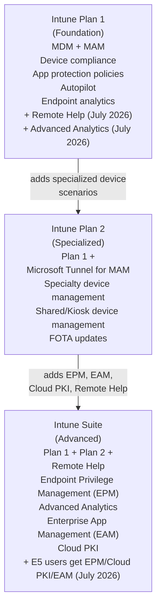
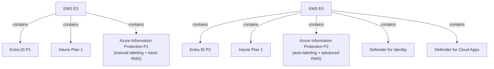

# 10 — Microsoft Intune, EMS & Windows Enterprise

> Back to [Index](00-index.md)

---

## Microsoft Intune

**What it is:** Microsoft's cloud-based endpoint management platform. It provides Mobile Device Management (MDM) and Mobile Application Management (MAM) for Windows, macOS, iOS, Android, and Linux devices.

**What problem it solves:** Organizations need to manage, secure, and configure employee devices without requiring those devices to be on-premises. Intune enables policies for encryption, passcode, app access, compliance assessment, and conditional access enforcement — all from a cloud console.



---

## Intune Plan 1 — Foundation

**Included in:** Microsoft 365 E3, E5, E7, F3, Business Premium, EMS E3, EMS E5

**Available as:** Standalone

### Key Capabilities

| Feature | Plan 1 |
|---------|--------|
| MDM — Windows 10/11, macOS, iOS, Android, Linux | ✅ |
| MAM — Protect apps without enrolling device | ✅ |
| Device compliance policies | ✅ |
| App protection policies | ✅ |
| Endpoint security policies (AV, FW, ASR, etc.) | ✅ |
| Conditional Access enforcement (with Entra P1) | ✅ |
| Windows Autopilot (zero-touch provisioning) | ✅ |
| BYOD support | ✅ |
| Endpoint Analytics | ✅ |
| Remote Help | ✅ (as of July 2026 for E3+) |
| Advanced Analytics | ✅ (as of July 2026 for E3+) |
| Microsoft Tunnel for MAM (VPN tunneling for managed apps) | ❌ (Plan 2) |
| Specialty device management (HoloLens, Surface Hub, etc.) | ❌ (Plan 2) |
| Endpoint Privilege Management | ❌ (Intune Suite) |
| Enterprise App Management | ❌ (Intune Suite) |
| Cloud PKI | ❌ (Intune Suite) |

---

## Intune Plan 2 — Specialized Device Scenarios

**Available as:** Add-on to Plan 1 ($4/user/month standalone)

**What it adds over Plan 1:**
| Feature | Description |
|---------|-------------|
| **Microsoft Tunnel for MAM** | Allows managed apps to connect to on-premises resources via a VPN tunnel *without* requiring full device enrollment. Critical for BYOD scenarios where employees won't enroll personal phones. |
| **Specialty device management** | Additional management capabilities for HoloLens 2, Surface Hub, and similar specialized hardware |
| **Shared device management** | Enhanced management for shared/kiosk devices (frontline worker scenarios) |
| **FOTA updates** | Firmware Over The Air updates for specific device types |

> **Who needs Plan 2?** Organizations with significant BYOD that need app-level VPN, or those managing specialized hardware like HoloLens. Most organizations use Plan 1 and don't need the additional Plan 2 features.

---

## Intune Suite — Advanced Endpoint Management

**Available as:** Add-on ($10/user/month); includes Plan 2

**When July 2026 changes apply:** Starting July 2026, Microsoft rolled capabilities into base E3/E5 licenses:
- **E3 users:** Remote Help and Advanced Analytics are now included (no Suite needed for these)
- **E5 users:** Remote Help, Advanced Analytics, Endpoint Privilege Management (EPM), Cloud PKI, and Enterprise App Management are now included in E5 (no Intune Suite needed for these specific features)

> **Practical impact:** For E5 customers, many of the Intune Suite features are now in the base E5 license as of July 2026. The Intune Suite remains relevant for E3 customers who need the advanced features, or for organizations wanting the full bundle.

### Suite Capabilities (as of September 2026)

| Feature | Description |
|---------|-------------|
| **Remote Help** | Secure remote assistance — help desk technicians can view and control a user's device with user consent. Built into Intune, more secure than third-party tools. |
| **Endpoint Privilege Management (EPM)** | Allow standard (non-admin) users to run specific applications with elevated permissions on a just-in-time, just-enough-access basis. No need to make users local admins. |
| **Advanced Analytics** | Enhanced endpoint analytics: battery health, anomaly detection, device query, custom dashboards |
| **Enterprise App Management (EAM)** | A curated catalog of ISV apps that can be deployed through Intune with automated app updates and version management |
| **Cloud PKI** | Microsoft-managed certificate infrastructure; issue and manage certificates for device authentication without on-premises PKI |

---

## Enterprise Mobility + Security (EMS)

**What it is:** A bundle that combines Microsoft Entra + Intune + Azure Information Protection. It was the predecessor to the "Microsoft 365" enterprise licensing model.

**Current status:** EMS is still actively sold as a standalone bundle for organizations that need identity/device/information protection without needing Microsoft 365 productivity apps.



### EMS E3

| Component | What it provides |
|-----------|-----------------|
| **Entra ID P1** | Conditional Access, dynamic groups, SSPR with writeback, hybrid identity |
| **Intune Plan 1** | MDM/MAM, device compliance, app protection |
| **Azure Information Protection P1** | Manual sensitivity labels, manual classification, basic RMS encryption |

### EMS E5

| Component | What it provides |
|-----------|-----------------|
| **Entra ID P2** | All P1 features + PIM, Identity Protection, risk-based Conditional Access, Access Reviews |
| **Intune Plan 1** | MDM/MAM |
| **Azure Information Protection P2** | Auto-labeling, automatic classification, advanced RMS |
| **Defender for Identity** | Active Directory attack detection |
| **Defender for Cloud Apps** | Full CASB |

### EMS vs Microsoft 365

| Feature | EMS E3 | M365 E3 |
|---------|--------|---------|
| Entra ID P1 | ✅ | ✅ |
| Intune Plan 1 | ✅ | ✅ |
| AIP P1 | ✅ | ✅ |
| Office apps (desktop/web) | ❌ | ✅ |
| Exchange Online | ❌ | ✅ |
| SharePoint / Teams / OneDrive | ❌ | ✅ |
| Windows Enterprise E3 | ❌ | ✅ |
| Defender for Endpoint P1 | ❌ | ✅ |

> **Who buys EMS without M365?** Organizations that already have Office 365 and want to add identity/device management capabilities without migrating to a Microsoft 365 plan. Also useful for organizations managing a mixed environment (e.g., Google Workspace for productivity + EMS for identity/device management).

---

## Windows Enterprise E3 / E5

**What Windows Enterprise licensing provides:** Advanced Windows features not available in Windows Pro, plus the right to use Windows from Microsoft's cloud.

### Windows Enterprise E3

| Feature | Description |
|---------|-------------|
| Windows 11 Enterprise | ✅ Upgrade rights from Windows 11 Pro |
| BitLocker | Full disk encryption |
| AppLocker | Application whitelisting/control |
| DirectAccess | Seamless VPN-like connectivity |
| Windows Defender Application Guard | Isolated browser sessions for untrusted content |
| Credential Guard | Virtualization-based security for credentials |
| Windows Sandbox | Isolated desktop environment for testing |
| Microsoft Managed Desktop | ✅ (with appropriate setup) |
| Windows Update for Business | ✅ |
| Windows Virtual Desktop rights | ✅ (access Windows from other devices) |
| Microsoft Defender Credential Guard | ✅ |

### Windows Enterprise E5

Adds over E3:
| Feature | Description |
|---------|-------------|
| Microsoft Defender for Endpoint P2 | EDR, automated investigation, threat analytics |
| Windows Defender Application Guard (enhanced) | ✅ |
| Windows Hello for Business (enhanced) | ✅ |

> **Note:** Microsoft 365 E3 includes Windows Enterprise E3 rights. Microsoft 365 E5 includes Windows Enterprise E5 rights. The Windows rights are per-user — each licensed user can activate Windows Enterprise on up to 5 devices.

### Per-User vs Per-Device Windows Licensing

**Per-user (via Microsoft 365 E3/E5):** Each licensed user can activate Windows Enterprise on up to 5 of their personal/assigned devices.

**Per-device (standalone Windows Enterprise):** A perpetual or subscription license tied to a specific device. Often used for kiosk or shared devices where multiple users log in.

For frontline workers (F1/F3): These plans do NOT include Windows Enterprise E3/E5. Organizations managing Windows devices for frontline workers need to purchase Windows Enterprise separately or use the Windows 10/11 Enterprise per-device licensing.

---

## Intune vs Entra vs Defender vs Purview — The Clear Distinction

This is one of the most common areas of confusion:

| Product | Primary purpose | Scope |
|---------|----------------|-------|
| **Microsoft Entra** | Identity and access — WHO is the user, should they get in, how privileged? | Identity plane |
| **Microsoft Intune** | Device management — IS the device healthy, compliant, configured? | Device plane |
| **Microsoft Defender** | Threat protection — IS there an attack happening, detect and respond | Security signals |
| **Microsoft Purview** | Data governance — IS the data classified, protected, compliant? | Data plane |

**They work together but solve different problems:**

```
User tries to access SharePoint
         ↓
Entra Conditional Access: Is this user low-risk? Is MFA satisfied? Is the device compliant?
         ↓ (answer: check Intune)
Intune: Is the device enrolled? Does it have BitLocker enabled? Is it running current AV?
         ↓
Access granted to SharePoint
         ↓
Purview DLP: What is the user doing with the data? Are they violating a DLP policy?
         ↓
Purview Insider Risk: Is this behavioral pattern suspicious over time?
         ↓
Defender for Cloud Apps: Is this app session anomalous? Is the user exfiltrating data?
```

---

## Sources

- [Microsoft Learn — Intune licensing](https://learn.microsoft.com/en-us/intune/fundamentals/licensing)
- [Microsoft — Intune pricing](https://www.microsoft.com/en-us/security/business/microsoft-intune-pricing)
- [TechCommunity — Introducing the new Intune Suite](https://techcommunity.microsoft.com/blog/intunecustomersuccess/introducing-the-new-microsoft-intune-suite/3755574)
- [Microsoft — EMS pricing](https://www.microsoft.com/en-us/microsoft-365/enterprise-mobility-security/compare-plans-and-pricing)
- [Microsoft Learn — Intune plan comparison](https://learn.microsoft.com/en-us/intune/fundamentals/licensing)
