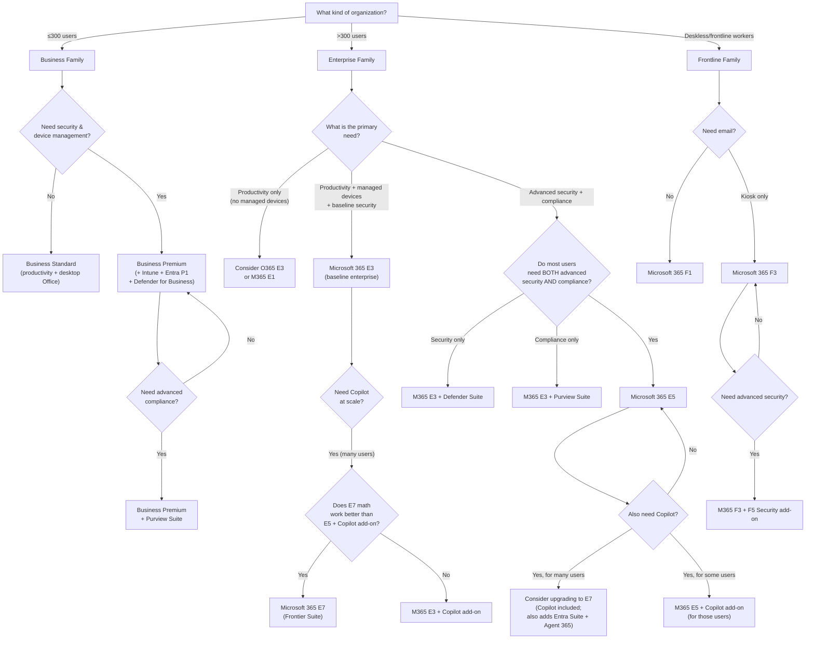

# 12 — Decision Guide: Trees, Misconceptions, Lookup Table & Cheat Sheet

> Back to [Index](00-index.md)

---

## Licensing Decision Tree



---

## "If I Need X, What License Do I Need?" {#if-i-need-x-what-license}

> This table shows the **minimum** qualifying license. Multiple licenses may qualify — always verify against the [Microsoft Purview service description](https://learn.microsoft.com/en-us/office365/servicedescriptions/microsoft-365-service-descriptions/microsoft-365-tenantlevel-services-licensing-guidance/microsoft-purview-service-description) and [Microsoft Defender service description](https://learn.microsoft.com/en-us/office365/servicedescriptions/microsoft-365-service-descriptions/microsoft-365-tenantlevel-services-licensing-guidance/microsoft-defender-service-description).

| Requirement | Minimum qualifying license | Prerequisites | Notes |
|------------|--------------------------|--------------|-------|
| **MFA (basic)** | Any M365 plan (Security Defaults) | None | Security Defaults = tenant-wide, no customization |
| **MFA (customizable methods)** | Entra ID P1 | None | Included in Business Premium, E3+ |
| **Conditional Access** | Entra ID P1 | None | Business Premium, E3, F1, F3 include P1 |
| **Risk-based Conditional Access** | Entra ID P2 | Entra P1 base | E5, E7, EMS E5, Defender Suite |
| **SSO (for Microsoft apps)** | Entra ID Free | None | All M365 plans |
| **SSO (for custom/SaaS apps via app proxy)** | Entra ID P1 | None | E3+ |
| **Dynamic Groups** | Entra ID P1 | None | E3+ |
| **SSPR with writeback (hybrid)** | Entra ID P1 | On-prem AD Connect | E3+ |
| **Privileged Identity Management (PIM)** | Entra ID P2 | P1 base | E5, E7, EMS E5, Defender Suite |
| **Access Reviews** | Entra ID P2 (basic) / Governance (advanced) | P1 base | E5 = basic; Governance/Suite = full |
| **Entitlement Management** | Entra ID P2 (basic) / Governance (advanced) | P1 base | E5 = basic; Governance/Suite = auto-assign + advanced |
| **Lifecycle Workflows** | Entra ID Governance | P1 base | Entra Suite, M365 E7 |
| **Entra Private Access (ZTNA)** | Entra Suite | P1 base | M365 E7 includes; standalone available |
| **Entra Internet Access (SWG)** | Entra Suite | P1 base | M365 E7 includes; standalone available |
| **Identity Protection (risky users/sign-ins)** | Entra ID P2 | P1 base | E5, E7 |
| **Intune MDM/MAM** | Intune Plan 1 | None | E3+, Business Premium, EMS E3+ |
| **Intune — Remote Help** | Intune Plan 2 or Suite (or E3+ as of July 2026) | Plan 1 | Now included in E3 (July 2026 update) |
| **Intune — Endpoint Privilege Management** | Intune Suite (or E5 as of July 2026) | Plan 1 | Now included in E5 (July 2026 update) |
| **Intune — Enterprise App Management** | Intune Suite (or E5 as of July 2026) | Plan 1 | Now included in E5 (July 2026 update) |
| **Intune — Cloud PKI** | Intune Suite (or E5 as of July 2026) | Plan 1 | Now included in E5 (July 2026 update) |
| **Defender for Office 365 P1** (Safe Links, Safe Attachments) | M365 Business Premium, MDO P1 standalone, M365 E5, Defender Suite | None | E3 has EOP only |
| **Defender for Office 365 P2** (Threat Explorer, AIR, Attack Sim) | M365 E5, O365 E5, Defender Suite, MDO P2 standalone | None | Includes P1 |
| **Defender for Endpoint P1** (prevention) | M365 E3, M365 F3, MDE P1 standalone | None | |
| **Defender for Endpoint P2** (full EDR + AIR + TVM) | M365 E5, Windows Enterprise E5, Defender Suite, MDE P2 standalone | None | |
| **Defender for Identity** (AD attack detection) | M365 E5, EMS E5, Defender Suite, MDI standalone | None | |
| **Defender for Cloud Apps** (full CASB) | M365 E5, EMS E5, Defender Suite, Purview Suite, MDCA standalone | None | E3 has basic cloud discovery only |
| **Microsoft Defender XDR** (full unified) | M365 E5 or Defender Suite | Defender products | Not a separate license; comes with qualifying Defender products |
| **Security Copilot** | M365 E5 or E7 | E5/E7 | 400 SCU/month per 1,000 users; standalone (SCU) also available |
| **Sensitivity Labels (manual)** | M365 E3, Business Premium (with AIP P1) | None | |
| **Auto-apply Sensitivity Labels** | M365 E5, Purview Suite | E3 base | |
| **DLP — Exchange, SharePoint, OneDrive** | M365 E3, O365 E3 | None | |
| **DLP — Teams** | M365 E5, Purview Suite | E3 base | |
| **Endpoint DLP** | M365 E5, Purview Suite | E3 base | |
| **Adaptive Protection** (IRM + DLP) | M365 E5, Purview Suite | E3 base + IRM | |
| **Retention Policies** | M365 E3, O365 E3, Business Premium | None | Basic; adaptive scope requires E5/Purview Suite |
| **Auto-apply Retention Labels** | M365 E5, Purview Suite (advanced) | E3 base | |
| **Records Management (advanced)** | M365 E5, Purview Suite | E3 base | |
| **Audit Standard** | M365 E3, O365 E3, Business Premium | None | 90-day retention |
| **Audit Premium** (1-year retention, crucial events) | M365 E5, O365 E5, Purview Suite | E3 base | |
| **10-year Audit Retention** | Audit Premium add-on | Audit Premium | Separate add-on to E5 |
| **eDiscovery Standard** | M365 E3, O365 E3, Business Premium | None | Search & export |
| **eDiscovery Premium** | M365 E5, O365 E5, Purview Suite | E3 base | Review sets, custodian holds, AI analysis |
| **Insider Risk Management** | M365 E5, Purview Suite | E3 base | |
| **Communication Compliance** | M365 E5, Purview Suite | E3 base | |
| **Information Barriers** | M365 E5, Purview Suite | E3 base | |
| **Customer Key** | M365 E5, O365 E5, Purview Suite | E3 base | |
| **Customer Lockbox** | M365 E5, O365 E5, Purview Suite | E3 base | |
| **Compliance Manager** (advanced templates) | M365 E5, Purview Suite | Any M365 | Basic Compliance Manager = all M365 |
| **Windows Enterprise** | M365 E3 (E3 rights), M365 E5 (E5 rights), Windows Enterprise standalone | Windows Pro | |
| **Power BI Pro** | M365 E5, O365 E5, Power BI Pro standalone | None | |
| **Phone System / Audio Conferencing** | M365 E5, O365 E5 | Calling Plan = add-on | |
| **Microsoft 365 Copilot** | M365 E3/E5 + Copilot add-on; or M365 E7 (included) | E3+ base | |
| **Security Copilot** | M365 E5 or E7 | E5/E7 | Capacity-based (SCUs) |
| **Entra Suite** | M365 E7 (included); standalone (requires P1 base) | Entra P1 | $12/user/month standalone |
| **Purview Suite** | Add-on to M365 E3 or O365 E3+EMS E3 | E3 base | |
| **Defender Suite** | Add-on to M365 E3 | E3 base | |
| **Agent 365** | M365 E7 (included); add-on to E5 | E5 or E7 base | |

---

## Common Microsoft Licensing Misconceptions {#common-misconceptions}

### 1. "E5 is just E3 with more Office features"

**Why people believe it:** E3 and E5 both have the same Office apps. The upgrade seems to be about "more."

**The truth:** E5 is a fundamentally different security architecture. The identity model changes (P2 risk-based access vs P1 policy-based). The endpoint model changes (full EDR + automated investigation vs prevention only). The compliance model changes (Insider Risk, eDiscovery Premium, Audit Premium). The additional productivity features (Power BI Pro, Phone System) are almost secondary to the security and compliance differences.

---

### 2. "E5 includes everything Microsoft sells"

**Why people believe it:** E5 is the most expensive per-user enterprise SKU (apart from E7), so it feels like "the top."

**The truth:** E5 does NOT include:
- Microsoft 365 Copilot (add-on)
- Agent 365 (E7 or add-on)
- Full Entra Suite (Private Access, Internet Access, full Governance — E7 or standalone)
- Intune Suite capabilities (EPM, EAM, Cloud PKI — though some now included in E5 as of July 2026 update)
- Defender Vulnerability Management Premium (add-on)
- 10-year Audit Log Retention (add-on)
- Security Copilot beyond the included SCU allowance

---

### 3. "E5 automatically gives me every Purview feature"

**Why people believe it:** E5 is described as having "advanced Purview."

**The truth:** E5 includes a comprehensive set of advanced Purview features, but not all features exist at all tiers. For example: Purview Data Connectors (third-party), certain advanced Records Management features, and 10-year audit retention require additional consideration or add-ons. Always check the Purview service description for specific capability requirements.

---

### 4. "Purview is one license"

**Why people believe it:** Microsoft Purview is a brand name that appears in licensing conversations as if it's a single thing.

**The truth:** Purview is a family of products. "Microsoft Purview" on your license check could mean: Audit Standard (free in E3), eDiscovery Standard (free in E3), auto-labeling (requires E5/Suite), Insider Risk Management (requires E5/Suite), or Communication Compliance (requires E5/Suite). Each capability has its own licensing requirement.

---

### 5. "Defender is one product"

**Why people believe it:** "Microsoft Defender" appears as a single brand.

**The truth:** Defender is four separate products (Defender for Office 365, Defender for Endpoint, Defender for Identity, Defender for Cloud Apps), each protecting a different surface, each with its own Plan 1/Plan 2 tiers, and each licensed separately. "I have Defender" means nothing without specifying which Defender product and which plan tier.

---

### 6. "Entra P2 equals Entra Suite"

**Why people believe it:** E5 includes Entra P2, and "Suite" sounds like "more P2."

**The truth:** Entra Suite = Entra P2 + Entra ID Governance + Entra Private Access + Entra Internet Access + Entra Verified ID premium. P2 gives you risk-based identity. The Suite gives you network access (ZTNA replaces VPN), advanced lifecycle automation, and verified identity. These are entirely different product categories.

---

### 7. "Purview Suite equals E5 Compliance"

**Why people believe it:** The terms "E5 Compliance" and "Purview Suite" are used interchangeably in some older documentation.

**The truth:** Microsoft 365 E5 Compliance was the old add-on name (legacy). Microsoft Purview Suite is the current add-on name. They refer to the same general concept (compliance add-on for E3), but the exact entitlements have evolved. "E5 Compliance" is a legacy SKU term — for new purchases, refer to "Purview Suite." The capabilities are largely the same, but the naming shift matters for procurement documentation.

---

### 8. "Business Premium is Business Standard + Defender"

**Why people believe it:** Business Premium adds Defender and security features to Standard.

**The truth:** Business Premium adds Defender for Business (a simplified SMB endpoint security product), Defender for Office 365 P1, Intune Plan 1, and Entra ID P1. These are four distinct product additions — not just "Defender on top of Standard." The identity management change (Entra P1 = Conditional Access) and device management change (Intune = full MDM) are as significant as the Defender addition.

---

### 9. "Copilot is included in E5"

**Why people believe it:** E5 is expensive and feels like it should include everything.

**The truth:** Microsoft 365 Copilot (the productivity AI in Word/Teams/Outlook) is NOT included in E5. It requires an additional add-on license. E5 includes Security Copilot (for security analysts, SCU-based). These are different products.

---

### 10. "E7 is just E5 renamed"

**Why people believe it:** E7 sounds like the next number after E5.

**The truth:** E7 = E5 + Microsoft 365 Copilot + Microsoft Entra Suite + Agent 365. It is a new bundle that became generally available May 1, 2026. The additions are substantial: Copilot (included, saving the add-on cost), the full Entra Suite (ZTNA, SWG, full governance), and Agent 365 (AI agent control plane). These represent meaningfully different capabilities, not a rebranding.

---

### 11. "If a feature appears in the admin center, I'm licensed for it"

**Why people believe it:** The feature is visible and may even function.

**The truth:** Microsoft's infrastructure is often provisioned at the tenant level. A feature appearing in the admin center means Microsoft has provisioned the technical capability — it does not mean every user is licensed. Using it without proper licensing is a compliance violation. Microsoft compliance reviews check for this.

---

### 12. "Only administrators need licenses for security features"

**Why people believe it:** The admin configures the feature, not the users.

**The truth:** Microsoft's licensing terms require every user who *benefits* from a service to be licensed. For Defender for Identity, all users whose identities are protected need licenses (not just the admin who configured MDI). For DLP, all users whose mailboxes or devices are subject to DLP policies need appropriate licenses.

---

### 13. "Every user in a tenant needs the same license"

**Why people believe it:** It seems simpler.

**The truth:** Mixed licensing is fully supported and common. You can assign different licenses to different users. Assign based on role and need. See [File 11 — Scenarios & Personas](11-scenarios-personas.md#mixed-licensing) for examples.

---

### 14. "Add-ons replace the base license"

**Why people believe it:** "I added the Purview Suite, so I don't need E3 anymore."

**The truth:** Add-ons supplement base licenses. The Purview Suite is an add-on to M365 E3 — it requires E3 (or qualifying equivalent) as a base. If you remove E3 and keep Purview Suite, the Purview Suite is not usable (no valid base).

---

### 15. "An add-on automatically includes its prerequisites"

**Why people believe it:** "I bought the add-on, shouldn't it work?"

**The truth:** You must have the prerequisite license assigned to the same user before the add-on is valid. If you buy Purview Suite add-ons for 50 users but only assign E3 to 40 of them, the 10 users with Purview Suite but no E3 base are in a compliance gap.

---

### 16. "Office 365 E5 and Microsoft 365 E5 are the same"

**Why people believe it:** They're both "E5."

**The truth:** Office 365 E5 = productivity + Defender for Office 365 P2 + advanced Purview + Phone System + Power BI Pro. It does NOT include Windows Enterprise, Entra P2, Intune, Defender for Endpoint, or Defender for Identity. Microsoft 365 E5 adds all of those on top of Office 365 E5.

---

### 17. "Intune and Entra are the same"

**Why people believe it:** They both appear in the same admin console (Intune admin center or Entra admin center) and are part of EMS.

**The truth:** Entra = identity (who are you, should you get in). Intune = device management (is your device healthy and configured). They work together but address different problems. Entra Conditional Access checks device compliance (provided by Intune) as one of its policy conditions — that's the integration point.

---

### 18. "Compliance and security are the same thing"

**Why people believe it:** They're often discussed together.

**The truth:**

| Security (Defender) | Compliance (Purview) |
|--------------------|---------------------|
| Prevent external attackers | Govern organizational data |
| Detect threats and breaches | Ensure regulatory adherence |
| Respond to incidents | Investigate internal violations |
| Protect infrastructure | Protect sensitive data classification |
| Defender products | Purview products |
| SOC team uses it | Compliance/legal team uses it |

They overlap in areas like Insider Risk Management (where an insider threat has both security and compliance dimensions), but they are fundamentally different disciplines with different products.

---

## Master Comparison Matrix

### Enterprise Plans

| Feature | O365 E1 | O365 E3 | O365 E5 | M365 E1 | M365 E3 | M365 E5 | M365 E7 |
|---------|---------|---------|---------|---------|---------|---------|---------|
| Desktop Office apps | ❌ | ✅ | ✅ | ❌ | ✅ | ✅ | ✅ |
| Exchange | Plan 1 | Plan 2 | Plan 2 | Plan 1 | Plan 2 | Plan 2 | Plan 2 |
| SharePoint / OneDrive / Teams | ✅ | ✅ | ✅ | ✅ | ✅ | ✅ | ✅ |
| Entra ID | Free | Free | Free | P1 | **P1** | **P2** | **Suite** |
| Conditional Access | ❌ | ❌ | ❌ | ✅ | ✅ | ✅ | ✅ |
| PIM / Identity Protection | ❌ | ❌ | ❌ | ❌ | ❌ | ✅ | ✅ |
| Entra Suite (ZTNA + SWG) | ❌ | ❌ | ❌ | ❌ | ❌ | ❌ | ✅ |
| Intune | ❌ | ❌ | ❌ | ❌ | Plan 1 | Plan 1 | Plan 1 |
| Defender for Endpoint | ❌ | ❌ | ❌ | ❌ | **P1** | **P2** | **P2** |
| Defender for Office 365 | EOP | EOP | **P2** | EOP | EOP | **P2** | **P2** |
| Defender for Identity | ❌ | ❌ | ❌ | ❌ | ❌ | ✅ | ✅ |
| Defender for Cloud Apps | ❌ | ❌ | ✅ | ❌ | Basic | ✅ | ✅ |
| Purview — Audit | Std | Std | **Prem** | Std | Std | **Prem** | **Prem** |
| Purview — eDiscovery | Std | Std | **Prem** | Std | Std | **Prem** | **Prem** |
| Purview — Insider Risk | ❌ | ❌ | ✅ | ❌ | ❌ | ✅ | ✅ |
| Auto-labeling | ❌ | ❌ | ✅ | ❌ | ❌ | ✅ | ✅ |
| Endpoint DLP | ❌ | ❌ | ✅ | ❌ | ❌ | ✅ | ✅ |
| Windows Enterprise | ❌ | ❌ | ❌ | ❌ | E3 | E5 | E5 |
| Power BI Pro | ❌ | ❌ | ✅ | ❌ | ❌ | ✅ | ✅ |
| Phone System | ❌ | ❌ | ✅ | ❌ | ❌ | ✅ | ✅ |
| Security Copilot | ❌ | ❌ | ❌ | ❌ | ❌ | ✅ | ✅ |
| M365 Copilot | ❌ | ❌ | ❌ | ❌ | Add-on | Add-on | **Included** |
| Agent 365 | ❌ | ❌ | ❌ | ❌ | ❌ | Add-on | **Included** |
| Seat limit | ∞ | ∞ | ∞ | ∞ | ∞ | ∞ | ∞ |

### Business Plans

| Feature | Business Basic | Business Standard | Business Premium |
|---------|--------------|-----------------|----------------|
| Desktop Office | ❌ | ✅ | ✅ |
| Exchange | Plan 1 | Plan 1 | Plan 1 |
| SharePoint / Teams | ✅ | ✅ | ✅ |
| Entra ID | Free | Free | **P1** |
| Conditional Access | ❌ | ❌ | ✅ |
| Intune | Basic Mobility | Basic Mobility | **Plan 1** |
| Defender (endpoint) | ❌ | ❌ | Defender for Business |
| Defender for O365 | EOP | EOP | **P1** |
| AIP / Sensitivity Labels | ❌ | ❌ | Manual (AIP P1) |
| Purview | Basic | Basic | Basic |
| Windows Enterprise | ❌ | ❌ | ❌ |
| Seat limit | **300** | **300** | **300** |

### Frontline Plans

| Feature | M365 F1 | O365 F3 | M365 F3 |
|---------|---------|---------|---------|
| Exchange | ❌ (K1 provisioned, not entitled) | Kiosk | Kiosk |
| Teams | ✅ | ✅ | ✅ |
| SharePoint / OneDrive | ✅ (2 GB) | ✅ (2 GB) | ✅ (2 GB) |
| Office web apps | Read-only | ✅ | ✅ |
| Office mobile apps | ❌ | ✅ | ✅ |
| Desktop Office | ❌ | ❌ | ❌ |
| Entra ID | P1 | ❌ | **P1** |
| Intune | Plan 1 | ❌ | **Plan 1** |
| Defender for Endpoint | ❌ | ❌ | **P1** |
| Seat limit | ∞ | ∞ | ∞ |

---

## Microsoft 365 Licensing Cheat Sheet {#cheat-sheet}

### Business Plans (≤300 users)
| Plan | One-line description |
|------|---------------------|
| Business Basic | Cloud email + Teams + SharePoint; browser/mobile Office; no desktop apps |
| Business Standard | Basic + desktop Office apps |
| Business Premium | Standard + Intune + Entra P1 + Defender for Business + Defender for O365 P1; SMB security baseline |

### Enterprise Plans (unlimited users)
| Plan | One-line description |
|------|---------------------|
| Microsoft 365 E1 | Light enterprise; cloud collaboration only; no desktop Office; minimal identity/security |
| Microsoft 365 E3 | Enterprise baseline: full Office + Exchange P2 + Intune P1 + Entra P1 + MDE P1 + Windows E3 |
| Microsoft 365 E5 | E3 + advanced security (Entra P2, MDE P2, MDO P2, MDI, MDCA, XDR) + advanced compliance (Insider Risk, eDiscovery Premium, Audit Premium) + Security Copilot + Power BI Pro |
| Microsoft 365 E7 | E5 + M365 Copilot (included) + full Entra Suite (ZTNA + SWG + Governance) + Agent 365; the "Frontier Suite" (GA May 2026) |

### Frontline Plans
| Plan | One-line description |
|------|---------------------|
| Microsoft 365 F1 | Minimal plan; Teams + SharePoint + Intune + Entra P1; no email entitlement; read-only Office |
| Microsoft 365 F3 | Frontline baseline; kiosk email + Office web/mobile + Teams + Intune P1 + Entra P1 + MDE P1 |

### Identity (Microsoft Entra)
| License | One-line description |
|---------|---------------------|
| Entra ID Free | Basic directory; security defaults MFA; SSO for Microsoft apps |
| Entra ID P1 | Conditional Access; dynamic groups; SSPR with writeback; hybrid identity |
| Entra ID P2 | P1 + risk-based CA; Identity Protection; PIM; Access Reviews; Entitlement Management |
| Entra ID Governance | P2 + Lifecycle Workflows; advanced access reviews; advanced entitlement automation |
| Microsoft Entra Suite | Governance + Entra Private Access (ZTNA) + Entra Internet Access (SWG) + Verified ID premium |

### Security (Microsoft Defender)
| License | One-line description |
|---------|---------------------|
| Defender for Office 365 P1 | Safe Links, Safe Attachments, anti-phishing (real-time protection for email/Teams) |
| Defender for Office 365 P2 | P1 + Threat Explorer, Attack Simulation, Automated Investigation & Response |
| Defender for Endpoint P1 | Prevention-only endpoint security (ASR, device control, application control) |
| Defender for Endpoint P2 | P1 + full EDR, automated investigation, threat analytics, advanced hunting |
| Defender for Identity | Detect Active Directory attacks: lateral movement, Kerberoasting, golden tickets |
| Defender for Cloud Apps | Full CASB: SaaS discovery, app governance, threat protection, session control |
| Defender XDR | Unified portal correlating all Defender signals; not a separate license |
| Microsoft Defender Suite | Add-on bundle = MDO P2 + MDE P2 + MDI + MDCA + Entra P2; requires E3 base |

### Compliance (Microsoft Purview)
| License | One-line description |
|---------|---------------------|
| Purview (E3 baseline) | Audit Standard, eDiscovery Standard, basic DLP, manual labels, basic retention |
| Purview (E5 advanced) | Adds: Audit Premium, eDiscovery Premium, Insider Risk, Communication Compliance, auto-labeling, Endpoint DLP, Customer Key, Customer Lockbox |
| Microsoft Purview Suite | Add-on to E3; delivers the same advanced capabilities as E5 without the E5 security features |

### Device Management (Microsoft Intune)
| License | One-line description |
|---------|---------------------|
| Intune Plan 1 | MDM + MAM; device compliance; app protection; Autopilot; included in E3+ |
| Intune Plan 2 | Plan 1 + Tunnel for MAM; specialty/shared device management; FOTA |
| Intune Suite | Plan 2 + Remote Help + EPM + Advanced Analytics + Enterprise App Management + Cloud PKI |

### AI (Microsoft AI Products)
| License | One-line description |
|---------|---------------------|
| Microsoft 365 Copilot | AI in Word, Teams, Outlook, Excel, PowerPoint + Copilot Chat grounded in M365 data; add-on to E3/E5; included in E7 |
| Security Copilot | AI for security analysts; threat hunting, incident investigation, posture assessment; included in E5/E7 (SCU-based) |
| Agent 365 | AI agent control plane: govern, monitor, and secure autonomous AI agents in M365; included in E7; add-on to E5 |

---

## Final Mental Model: The 7-Step Framework

When evaluating licensing for any user or organization, walk through these steps:

```
STEP 1: Worker type
├── Business (≤300 users) → Business family
├── Enterprise (unlimited) → E-series
└── Frontline (deskless) → F-series

STEP 2: Productivity foundation
├── Need desktop Office? → Standard/E3/E5/E7
├── Web/mobile only? → Basic/F-series
└── Minimum (light enterprise)? → E1

STEP 3: Identity level
├── Basic MFA only → Entra Free (Security Defaults)
├── Conditional Access, dynamic groups → Entra P1 (E3/Business Premium/F3)
├── Risk-based CA, PIM, Identity Protection → Entra P2 (E5)
├── Lifecycle automation + advanced governance → Entra Governance (E7/Suite)
└── ZTNA + SWG + full governance → Entra Suite (E7/standalone)

STEP 4: Security level
├── EOP baseline → any M365 plan
├── Safe Links + Safe Attachments → MDO P1 (Business Premium)
├── Full email security + threat hunting → MDO P2 (E5/Defender Suite)
├── Prevention-only endpoint → MDE P1 (E3)
├── Full EDR + automated response → MDE P2 (E5/Defender Suite)
├── AD attack detection → MDI (E5/Defender Suite)
├── SaaS app security → MDCA (E5/Defender Suite)
└── Full XDR posture → E5 or E3 + Defender Suite

STEP 5: Compliance / data level
├── Audit Standard + eDiscovery Standard → E3
├── Audit Premium + eDiscovery Premium + Insider Risk → E5 or E3 + Purview Suite
├── All advanced compliance → E5 or Purview Suite
└── Agent-aware governance → E7

STEP 6: Device management
├── Basic MDM → Intune Plan 1 (E3+)
├── Specialized devices (BYOD VPN, shared) → Intune Plan 2
└── EPM + EAM + Cloud PKI + Remote Help → Intune Suite (or E5 from July 2026)

STEP 7: AI requirements
├── AI in productivity apps → M365 Copilot (add-on to E3/E5; included in E7)
├── AI for security team → Security Copilot (E5/E7; standalone via SCUs)
└── AI agent governance → Agent 365 (E7; add-on to E5)
```

### 30-Bullet Summary

1. Microsoft 365 licensing is a stack of product families, not a single ladder.
2. E3/E5/E7 are bundles — they combine different tiers of identity, security, compliance, device management, and AI.
3. E7 = E5 + Microsoft 365 Copilot + Entra Suite + Agent 365 (GA May 1, 2026).
4. Microsoft 365 E3 ≈ Office 365 E3 + Windows Enterprise E3 + EMS E3.
5. Microsoft 365 E5 ≈ Office 365 E5 + Windows Enterprise E5 + EMS E5 + Security Copilot.
6. Office 365 E5 and Microsoft 365 E5 are different products; M365 E5 adds Windows, Entra P2, MDE P2, MDI, MDCA.
7. Entra P1 = Conditional Access, dynamic groups, SSPR, MFA control.
8. Entra P2 = P1 + risk-based CA, PIM, Identity Protection, Access Reviews.
9. Entra Governance = P2 + Lifecycle Workflows, advanced entitlement automation.
10. Entra Suite = Governance + Private Access (ZTNA) + Internet Access (SWG) + Verified ID premium.
11. Defender is four products: Defender for Office 365, Endpoint, Identity, Cloud Apps.
12. Defender for Endpoint P1 = prevention only. P2 = full EDR + automated investigation.
13. Defender for Office 365 P1 = real-time protection. P2 = + investigation, attack simulation.
14. Defender XDR is a portal/correlation layer, not a separate license.
15. Purview is a family: audit, eDiscovery, DLP, IRM, sensitivity labels, records management, and more.
16. Purview baseline (audit standard, eDiscovery standard, basic DLP) is in E3.
17. Advanced Purview (eDiscovery Premium, Insider Risk, Audit Premium, auto-labeling) is in E5 or Purview Suite add-on.
18. Purview Suite = advanced compliance add-on for E3 users who don't need full E5 security.
19. Microsoft 365 Copilot is NOT included in E5. It is included in E7. It is an add-on for E3/E5.
20. Security Copilot IS included in E5/E7 (400 SCU/month per 1,000 users).
21. Agent 365 = AI agent governance. Included in E7. Add-on for E5 users.
22. Intune Plan 1 = MDM/MAM foundation. Plan 2 = specialized devices. Suite = EPM/EAM/Cloud PKI/Remote Help.
23. Starting July 2026: E3 gets Remote Help and Advanced Analytics; E5 gets EPM, EAM, Cloud PKI from base license.
24. Business Premium = full SMB security (Intune + Entra P1 + Defender for Business + MDO P1); max 300 users.
25. Frontline F1 = no email entitlement. F3 = kiosk email + full web/mobile Office + MDE P1.
26. Mixed licensing is fully supported: different users in the same tenant can have different license tiers.
27. "Technically available in the portal" ≠ "licensed for use." Feature presence does not equal entitlement.
28. Every user who *benefits* from a security or compliance service must be licensed, not just the admin who configured it.
29. E3 + Defender Suite + Purview Suite ≈ E5 capability, but is not officially Microsoft-equivalent — and costs more SKU management overhead.
30. When deploying Copilot, pair it with Purview (sensitivity labels, DLP, SharePoint Advanced Management) to prevent data oversharing via AI.

---

## How to Read Microsoft Licensing Documentation

### Key sources (in order of authority)
1. **Microsoft Product Terms** — [microsoft.com/licensing/terms](https://www.microsoft.com/licensing/terms) — the legal source of truth
2. **Microsoft Learn Service Descriptions** — [learn.microsoft.com](https://learn.microsoft.com) — detailed feature-by-feature licensing tables
3. **Microsoft Licensing Guidance** — [microsoft.com/licensing/guidance](https://www.microsoft.com/licensing/guidance) — specific guidance per product family
4. **Product pages** — [microsoft.com/security](https://www.microsoft.com/security) — marketing overviews; always verify specific claims against service descriptions

### Reading a service description
- Look for the "Available plans" section listing qualifying licenses
- "Tenant-level service" = feature is provisioned for the whole tenant; still need per-user licenses
- "Requires one of the following" = any of those licenses qualifies; choose the most economical
- "Add-on" always has a "prerequisite" listed
- "Standalone" = can be purchased without a base M365 license

### Warning: Outdated documentation
Microsoft updates licensing frequently. A blog post or comparison table from 2022 may be significantly wrong in 2026. Always check:
- The `ms.date` on Microsoft Learn articles (visible in page metadata)
- The Product Terms for the current effective date
- Release announcements in the Microsoft 365 Blog and TechCommunity

---

## Sources

- [Microsoft Learn — M365 plan options](https://learn.microsoft.com/en-us/office365/servicedescriptions/office-365-platform-service-description/office-365-plan-options)
- [Microsoft Learn — Purview service description](https://learn.microsoft.com/en-us/office365/servicedescriptions/microsoft-365-service-descriptions/microsoft-365-tenantlevel-services-licensing-guidance/microsoft-purview-service-description)
- [Microsoft Learn — Defender service description](https://learn.microsoft.com/en-us/office365/servicedescriptions/microsoft-365-service-descriptions/microsoft-365-tenantlevel-services-licensing-guidance/microsoft-defender-service-description)
- [Microsoft Learn — Entra licensing](https://learn.microsoft.com/en-us/entra/fundamentals/licensing)
- [Microsoft Learn — Intune licensing](https://learn.microsoft.com/en-us/intune/fundamentals/licensing)
- [Microsoft Learn — E3/E5/E7 Copilot feature comparison](https://learn.microsoft.com/en-us/microsoft-365/copilot/microsoft-365-copilot-license-feature-overview)
- [Microsoft TechCommunity — M365 E7 GA announcement](https://techcommunity.microsoft.com/blog/microsoft_365blog/microsoft-365-e7-and-agent-365-are-now-generally-available/4516295)
- [Microsoft Product Terms](https://www.microsoft.com/licensing/terms/en-US/product/changes/)
- [Microsoft — Subscription Suites Licensing Guidance](https://www.microsoft.com/licensing/guidance/subscription-suites)
